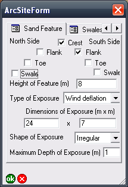

```{r, echo = FALSE}
# extract code from main manuscript file into a new R file
# so we can run select chunks from that in this file
library(knitr)
opts_chunk$set(echo = FALSE, 
               messages = FALSE, 
               warnings = FALSE, 
               dpi = 600)
               # fig.width = 12
               #fig.show = 'hide'
               
invisible(purl("paper.Rmd",  
               output="temp",
               quiet=TRUE))
read_chunk("temp")
```

Affiliations:

Ben Marwick (corresponding author)
University of Washington
Denny Hall 117, Box 353100
Seattle, WA 98195-3100 USA

t. (+1) 206.552.9450 
f. (+1) 206.543.3285
bmarwick@uw.edu 

Peter Hiscock   
The University of Sydney, Sydney NSW, Australia

Philip Hughes    
Department of Archaeology, Flinders University, GPO Box 2100, Adelaide, SA, 5001

Marjorie Sullivan    
The Australian National University, Canberra ACT 0200, Australia and 
Huonbrook and Environment and Heritage P/L, PO Box 97 Moruya NSW 2537, Australia

##### . 
<!--- page break --->
  

## Introduction

In this supplementary file we describe our decision to use a mobile GIS, and our field data collection workflow, and provide diagnostics for the linear models presented in the main text. 

### Mobile GIS and field data collection workflow

The decision to use a mobile GIS was based on four specific advantages over paper-based systems of the numerous benefits listed by Tripcevich (2004a; 2004b), Clarke (2004) and Wagtendonk and De Jeu (2007): 

1.	Mobile GIS results in substantial efficiencies when data collection is intensive, for example when many sites will be recorded per person per day. Survey planning indicated that an average of 10 sites per person per day would be recorded and up to 100 sites per person per day would be possible. If a paper-based recording system had been adopted, only a fraction of the more than 16,000 sites located would have been able to be recorded in the time and with the resources available. An additional related advantage is that the data are stored in a form that makes them immediately available for spatial or statistical analyses, and interim reporting.

2.	A highly structured digital recording system would minimize recording errors and eliminate the potential for errors and the time-costs of transcribing data from field notes or recording sheets into a computer (Schneiderman-Fox & Pappalardo 1996). Given the large number of sites expected, the time saved by eliminating transcription was expected to be substantial. 

3.	There were other digital datasets, including fence and road locations, previously surveyed areas and recorded sites, and terrain units that covered all of the survey area. Over 95% of the survey was covered by good quality recent air photography. Some of the thematic maps had been digitized, other data were able to be digitized and stored as shapefiles by the mining company, BHP Billiton. While paper maps can provide this information, and may be easier to read than a small screen in bright sun, a mobile GIS gives more immediate context awareness (Pascoe et al. 1999). In particular the mobile GIS enables a user to determine location relative to other features and automates calculations relating to these features such as distance, direction and area. 

4.	Mobile GIS is most effective on large multi-year projects where the time and expense of setup and training is offset by fieldworkers becoming increasingly efficient with the technology over time. The mining project has multiple stakeholders, including indigenous groups, company executives, government authorities as well as the survey team members, and mobile GIS data are collected in a format that can be shared easily from a server-computer GIS. 

The basic hardware and software used were similar to those described in previous studies (McPherron & Dibble 2003; Tripcevich 2004b; Given & Hyla 2006), including ruggedised handheld computers (TDS Recon and Nomad, described by Clegg et al. (2006) with a touchscreen interface and built-in GPS (Holux GM-270U and SiRFStar III). These PDAs run Windows Mobile 6 operating system and ESRI ArcPad software (Figure \@ref(fig:arcpad)). All of our configuration files, recording forms, and on-the-fly analysis scripts are archived online at <http://doi.org/10.5281/zenodo.11833>. Since our project began we have noted that newer models of the handheld computers have appeared, with improvements in processing speed, display quality, battery life, and a reduction in cost. 

```{r arcpad, fig.cap="View of one page of the recording form showing typical data entry controls such as checkboxes, dropdown fields and text and number fields.", echo=FALSE}



```

ESRI’s suite of programs is ubiquitous in the private sector and in higher education (http://www.gisjobs.com/survey_all/), and extensive support is available from other users in freely accessible online fora. Free and open source alternatives are relatively new and have a much smaller user and developer community and fewer online resources (Stankovic et al. 2004; Steiniger & Hay 2009). While the use of proprietary software made the cost of the system relatively high, future mobile GIS projects could be run at a lower cost, for example using free open source data collection software designed for smartphones such as the Open Data Kit for Android (Anokwa et al. 2009). At the time we were planning our fieldwork there was no open source tool-chain that provided equivalent functionality to the ESRI software.

Although there is a variety of software for mobile GIS (Ancona et al. 1999; Ryan et al. 1999; Hall & Gray 2004; Döner & Yomralıoğlu 2008; Sobotkova 2013), ArcPad has four important features that made it preferable for this use: 

1.	Real-time capture and display of GPS data in NMEA format. In addition to position, ArcPad can display detailed telemetry (e.g. speed, direction) and information about the quality of the data (number of satellites, position error). This is useful for navigation and coverage calculations during the survey. 

2.	ArcPad can display the user’s position in context with other datasets. ArcPad uses the standard GIS convention of data layers to produce maps displaying multiple datasets. This is useful for showing the user custom datasets such as the location of tracks, fences, previously recorded and surveyed areas and detailed aerial photography. 

3.	ArcPad allows rapid input of field data into a database. Data files created during the survey can be appended to a master record at the end of each day for rapid analysis, reporting and safe archiving. 

4.	The extensive use of ArcPad in other industries and disciplines means there are numerous examples of customized ArcPad applications, for example urban maintenance, ecological survey purposes and disaster management, available at online support fora that were useful to adapt for the archaeological survey (cf. Tripcevich 2004b: 19).

The ArcPad recording forms, and Access database for storing and querying the data collected by the mobile GIS, were designed and tested by the authors over a total of two months prior to fieldwork. This startup phase required specialized skills in creating XML files that determined the user interface of the recording forms, writing VBScript that controls the actions that occurred in the forms (such as validation of input and on-the-fly calculations), and writing SQL queries to summarize field data in ArcGIS and Access on daily, weekly and other schedules for quality control and reporting. The main issues encountered during the startup period were the learning curves of these three languages (none of us had any prior experience), programming of input validation scripts to minimize invalid data entry (ie. preventing accidental attempts by a user to enter improbably large or small values for site attributes), and optimizing the user interface to combine readability of the ArcPad recording forms with a logical and efficient layout of the data collection controls (ie. text boxes, drop-down menus, radio buttons, etc.).

The original paper recording forms that had been used in the region (Hiscock & Hughes 1983) were revised extensively and translated into XML to design ArcPad forms using ESRI’s ArcPad Studio program and a free text editor (Notepad++). The XML format has the advantages of being widely used, well-documented and editable with the most basic text editing software (e.g. the forms can be edited directly on the PDAs in the field). As much as possible the data input options on the user interface were constrained using drop-down menus, check boxes and radio buttons rather than allowing flexible but error-prone data input using text boxes (FIG 3).

With more than 20 archaeologists using this system, most of whom had no prior experience with GIS, these input constraints helped speed data entry, standardize data collection, avoid invalid data and minimize data cleaning time. XML was also used for ArcPad configuration files to set communication variables between the GPS and the recording form, and to maximize the onscreen map area by hiding rarely used toolbar buttons. These configuration files were prepared during the startup period and afterwards only rarely altered. 

In addition to the custom ArcPad recording form, scripts were written to calculate certain fields automatically based on entered data, check data input on the fly, prompt the user if certain conditions were not met and provide information to the user about what to do when recording a site. ArcPad forms were scripted using VBScript, which like XML, is widely used, well-documented and editable using any text editor. TABLE 3 describes some of the ways VBScript was used to control data input. VBScript and SQL were used to move the data from the PDA to a desktop computer, append data to a master database, update the mining company's heritage dataset to ensure newly recorded sites could be protected, check for duplicates and assign unique identifiers to sites. GPS tracklog data were recorded constantly during survey and archived with ArcGIS to prevent resurveying of the same area, to show survey coverage, and hence demonstrate the absence of sites from some parts of the landscape. 

A typical workflow during survey would be for an archaeologist to use ArcGIS to select the area to be surveyed, export the GIS data for that selection (ie. aerial photograph raster file, previously recorded archaeological sites polygon shapefile, and road and fences polyline shapefile) from the desktop to the handheld computers, conduct the survey and enter data onto the mobile GIS when sites are recorded, then return to the desktop computer and download the day’s site and tracklog data into the Access database, validate the recorded sites by running prepared queries that summarize the day’s finds and visualize the tracklogs and recorded sites in ArcGIS, and finally backup the day’s data to three separate locations. 

Sites located during the 2007-2009 surveys were recorded as single points into a point shapefile that was stored as a flat table. The co-ordinates for each point were averaged from ten positions captured by the GPS to improve the reliability of site location data to give an estimated horizontal accuracy of 2 m. Using this system, information about site location, environmental context, site size, number of artefacts, artefact raw materials, the presence and abundance of certain implement types (e.g. backed artefacts, tulas, grinding stones, hammerstones), the presence of hearths and attributes of knapping floors was collected. In more focused surveys since 2009 in areas outside the original 515 km2 survey area polygon shapefiles have been used to map the boundaries of sites. When recording polygon features a minimum of five positions are averaged at each vertex to improve location accuracy. Although ArcPad allows for direct capture of digital images and other data input (e.g. measurements of stone artefacts from digital calipers), these were not relevant to the survey goals and these features were not utilized. 

Data collection with a mobile GIS enabled our survey team to collect the massive amount of data collected during survey fieldwork and substantially reduce transcription time and error (Fitzpatrick 2002; McPherron & Dibble 2003; Tripcevich 2004a; 2004b). Our experience is comparable to that of Döner and Yomralıoğlu (2008), who recorded the time spent on field data collection and transferring data using both mobile GIS and a paper and GPS system for a project mapping transport networks for rural settlements in Turkey. They observed that the most substantial time savings were gained during data transfer. The pattern they document is a three-fold increase in the rate of site recording with mobile GIS. The same general pattern of time saving was observed in our history of research at Olympic Dam. Our pre-2007 data was transferred from field notes to a computer in 8-10 days after the survey concluded, while our 2007-2009 data was transferred from the mobile GIS to the desktop computer in less than five minutes per fieldwork day. 

The Olympic Dam sites fall into a narrow range of site types and stone artefacts within them are patterned in highly repeated ways that suited a systematic recording protocol. An important consideration in evaluating this use of mobile GIS and traditional methods is the regularity of the archaeological materials that were recorded. Projects that encounter high levels of variation, or cannot anticipate the kinds of data to be recorded, might benefit more from freeform data capture rather than the tightly controlled data entry fields that were an important advantage for this survey. Of course the value of more flexible data entry and subsequent problems for analysis would need to be balanced against the enhanced uniformity and accuracy of data when entry is tightly controlled and subject to automatic error checking and defined value limits.

As a final observation, it is noted that the disruption to fieldwork when the mobile GIS system fails may be underrepresented in the previous literature on mobile GIS in archaeology (McPherron & Dibble 2003; Tripcevich 2004b; but see McCaffrey et al. 2005). Mobile GIS is a complex and flexible setup that replaces many pieces of equipment (including tape measures, compass, notebooks) and if the handheld computer fails during a paperless survey then fieldworkers are limited in the tasks they can perform. This was a more serious concern in the early implementation of mobile GIS and more recent equipment and software are mostly reliable and robust. Breakdowns can never be completely avoided however and during the Olympic Dam survey their impacts were mitigated with multiple nightly data backups and keeping redundant functioning equipment on hand for immediate replacement of broken units, to minimize delays caused by waiting for repairs.  When the sites database was 'cleaned' at the end of the survey stage, serious errors (ie. fields containing data outside of a credible range or containing a mix of integers and non-integers, mostly likely due to accidents during data entry) and omissions (fields left blank or with data that is incomplete) were found to have occurred in fewer than 0.5% of the sites. Sites with problematic data were re-recorded and the unclean recorded were marked so they could be excluded from analysis. 

Undoubtedly McCoy and Ladefoged (2009) were correct in forecasting that mobile GIS and related spatial technologies will continue to change archaeology and contribute to its progress, despite the steep learning curve for current systems. As hardware becomes more affordable it will become more widely used and better supported by communities of users, lowering the barriers to use by archaeologists. Similarly as archaeology reaches into new directions and new methods, such as information science (cf. Llobera 2010), mobile GIS is likely to expand beyond a replacement of paper forms to include the capture and in-field peer-to-peer collaboration with large and more complex datasets including imagery, video and remote sensing data. 

### References cited

Ancona M, Dodero G, Mongiardino M and Traverso A 1999 Taking Digital Notes in the Field: the Archeo tool-set. In: JA Barceló, I Briz and A Vila (eds). Computer Applications and Quantitative Methods in Archaeology (BAR International Series 757) 117-121. Archaeopress, Oxford.

Anokwa Y, Hartung C, Brunette W, Borriello G and Lerer A 2009. Open source data collection in the developing world. Computer 42(10), 97-99.

Clarke K, C. 2004. Mobile Mapping and Geographic Information Systems. Cartography and Geographic Information Science 31, 131-136.

Clegg P, Bruciatelli L, Domingos F, Jones RR, De Donatis M and Wilson RW 2006. Digital geological mapping with tablet PC and PDA: A comparison. Computers & Geosciences 32(10), 1682-1698.

Doner F and Yomralioglu T 2008. Examination and comparison of mobile GIS technology for real time geo-data acquisition in the field. Survey Review 40(309), 221-234.

Fitzpatrick T 2002. Using ArcPad forms to streamline data collection. ArcUser July-Sept, 56-58.

Given O and Hyla S 2006. Forging Partnerships in Laos. Expedition 48(1), 38-39.

Hall M and Gray P 2004 Mobile Support for Team-Based Field Surveys. In: S Brewster and M Dunlop (eds). Mobile Human-Computer Interaction – MobileHCI 2004 105-217. Springer Berlin / Heidelberg.

Hiscock P and Hughes PJ 1983. One method of recording scatters of stone artefacts during site surveys. Australian Archaeology 17, 87-98.

Llobera M 2010. Archaeological Visualization: Towards an Archaeological Information Science (AISc). Journal of Archaeological Method and Theory, 1-31.

McCaffrey K, Jones R, Holdsworth R, Wilson R, Clegg P, Imber J, Holliman N and Trinks I 2005. Unlocking the spatial dimension: digital technologies and the future of geoscience fieldwork. Journal of the Geological Society 162(6), 927.

McCoy MD and Ladefoged TN 2009. New Developments in the Use of Spatial Technology in Archaeology. Journal of Archaeological Research 17(3), 263-295.

McPherron S and Dibble H 2003. Using computers In adverse field conditions: Tales from the Egyptian desert. The SAA Archaeological Record 3(5), 28-32.

Pascoe J, Ryan N and Morse D 1999. Issues in developing context-aware computing. Handheld and ubiquitous computing 1707/1999, 208-221.

Ryan N, Pascoe J and Morse DR 1999 FieldNote: extending a GIS into the field. In: JA Barcelo, I Briz and A Vila (eds). New Techniques for Old Times: Computer Applications in Archaeology, 1998 (BAR S755). Archaeopress, Oxford 

Schneiderman-Fox F and Pappalardo AM 1996. A paperless approach toward field data collection: An example from the Bronx. SAA Bulletin 14(1), 1-18.

Sobotkova A 2013. "Android GIS – not ready for prime time (poster)." Computer Applications and Quantitative Methods in Archaeology  Retrieved 22 Sept 2014, from https://www.fedarch.org/wordpress/wp-content/uploads/2013/03/AdelaPoster.pdf.

Stankovic J, Neteler M and Flor R 2004. Mobile Wireless GRASS GIS for Handheld Computers Running GNU/Linux. Transactions in GIS 8(2), 225-233.

Steiniger S and Hay GJ 2009. Free and open source geographic information tools for landscape ecology. Ecological Informatics 4(4), 183-195.

Tripcevich N 2004a. Flexibility by Design: How Mobile GIS Meets the Needs of Archaeological Survey. Cartography and Geographic Information Science 31(3), 137-151.

Tripcevich N 2004b. Mobile GIS in archaeological survey. The SAA Archaeological Record(May).

Wagtendonk AJ and De Jeu RAM 2007. Sensible field computing: Evaluating the use of mobile GIS methods in scientific fieldwork. Photogrammetric Engineering and Remote Sensing 73(6), 651.

### Diagnostics for the linear models presented in the main text

```{r, ref.label="mobilegisefficiency", results = "hide"}
```

```{r}
library(ggplot2)
library(ggfortify)
```

The plots below show the diagnostic plots for the linear model predicting the number of sites recorded per person, per day from the frequencies of occurrence of sites km^2^ for all field seasons (pre-2007, 2007-2009)

```{r fig.width=10, fig.height=8}
autoplot(mobile_gis_efficiency_lm_out, 
         which = 1:6, 
         ncol = 2, 
         label.size = 3) + 
  theme_bw(base_size = 10)
```

The plots below show the diagnostic plots for the linear model predicting the number of sites recorded per person, per day from the frequencies of occurrence of sites km^2^ for the 2007-2009 field seasons only:

```{r fig.width=10, fig.height=8}
autoplot(mobile_gis_efficiency_lm_2007_2009_out, 
         which = 1:6, 
         ncol = 2, 
         label.size = 3) + 
  theme_bw(base_size = 10)
```


