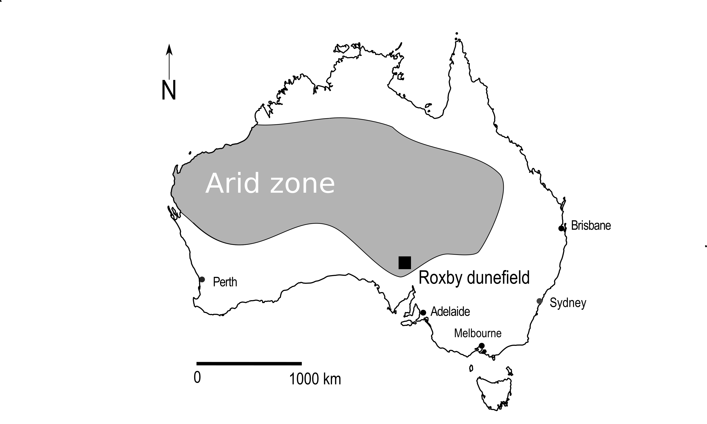

```{r setup, include=FALSE}
# image width should be 90 mm for 1 col, 140 mm for 1.5 col, 190mm for two cols
fig_width_two_cols <- 190/25 # inch
fig_width_one_col <- 90/25 # inch

library(knitr)
opts_chunk$set(echo = FALSE,
               warning = FALSE,
               message = FALSE,
               dpi = 900,
               cache = TRUE)
options(warn = -1)

```

Affiliations:

Ben Marwick (corresponding author)
University of Washington
Denny Hall, Box 353100
Seattle, WA 98195-3100 USA

t. (+1) 206.552.9450 
f. (+1) 206.543.3285    
bmarwick@uw.edu 

Peter Hiscock   
The University of Sydney, Sydney NSW, Australia     

Marjorie Sullivan   
The University of Sydney, Sydney NSW, Australia      
Huonbrook and Environment and Heritage P/L, PO Box 97 Moruya NSW 2537, Australia

Philip Hughes  
Flinders University, Adelaide, South Australia, Australia     
Huonbrook and Environment and Heritage P/L, PO Box 97 Moruya NSW 2537, Australia

##### . 
<!--- page break --->
  
## Introduction

A key step in understanding past human use of landscapes is investigating how people adapted their behaviours to the environmental variations they encountered. When analysing the residues of these behaviours, archaeologists often depend on comparing modal attributes of archaeological sites between discrete patches of landscapes (e.g. Barton 2003). Variations in human behaviour at landscape boundaries are more challenging to investigate, despite their importance in understanding sensitivity to landscape differences. Previous work on past human behaviours at ecological interfaces has focused on regions of highly contrasting biomes. For example, Epp (1985) found that archaeological sites were more concentrated in an ecotone (i.e. ecological transition area) where plains grasslands meet the boreal forest in Saskatchewan, compared to within those biomes. Epp’s work is typical of much early archaeological work on ecotones, with claims that ecotonal areas contain higher populations and diversities of flora and fauna (Struever 1968; Glassow and Leone 1972). This increased variety and density of plants and animals, often described as an ‘edge effect’, has been a focus of archaeological research. For example, it was claimed by Harris et al. (1969) to be a causal factor in the emergence of agriculture. This edge effect was also extended to human culture, with Gummerman and Johnson (1971) arguing for increased human cultural diversity in ecotonal zones of central Arizona. In Australia edge effects in landscape resources and their exploitation have also been discussed. For instance, Hughes and Hiscock (1982) noted apparent edge effects in the concentration of stone artefact scatters along landscape boundaries in arid northern South Australia. 

These uses of the ecotone and edge effect concepts declined in the archaeological literature after several critiques pointed out that archaeologists had been overly simplistic in their use of many ecological concepts (Rhoades 1978; Hardesty 1980; King and Graham 1981). Problems with these previous approaches include ignoring controversies among biologists about the definition of ecotones, unjustified assumptions about the uniformity of all ecotones, and unverified assumptions about edge effects always increasing the amount of food species available to humans. Alternative approaches to investigating landform boundary effects can be found in the work of Kimes et al. (1982), who used distribution of artefacts to see how culture group areas related to landform boundaries. However, much recent work on archaeological settlement patterns of hunter-gatherers has eschewed boundaries in favour of analysing straight line distances from key resources such as raw materials for stone artefacts, as these can be easier to measure and interpret than landscape boundaries (Daniel 2001; Jones et al. 2003). Here we pursue a new approach to understanding boundaries by focusing on subtle variations in landscape characteristics within a biome, rather than between them. By focusing on continuous variation, rather than step-wise shifts in the archaeological record across ecological interfaces, we introduce a new approach to studying behaviours of prehistoric forager groups at interface zones. 

In this study we use the results from a sample of hand-held GIS-enabled archaeological site recordings to ask if it is possible to observe gradients of change in archaeological materials over distance to understand forager choices of the optimum locations for their activities in respect to environmental boundaries. We predict that prehistoric foragers were sensitive to subtle differences in resource structure as gradients across landscape boundaries. This approach may be contrasted with concepts of linear boundaries with step-wise shifts in habitability. The step-wise approaches are useful because they make comparative landscape analysis more tractable in many contexts and at different scales. For example, the spatial scales of much previous work on prehistoric arid zone foragers has ranged from continental (Williams et al. 2013; Bird et al 2016) to ecological regions (Holdaway et al. 2013). In this paper, we introduce a novel focus on human behaviour in the arid zone: the interface between two types of subtly different landscapes. We show that prehistoric forager groups' decisions about how they occupied the study area were sensitive to subtle differences in local landscape characteristics.

Our work is motivated by previous archaeological work on cultural landscapes of foragers in Australian arid and semi-arid zones that emphasizes the relationship between settlement organization and both exploitable resources and prominent landscape features such as dunes, occurrences of flakeable rocks, pans, springs and salt lakes (Hughes and Hiscock 1982; Veth 1993; Napton and Greathouse 1996; Holdaway 1998; Barton 2003; Smith 2006; Fanning et al. 2008; Smith et al. 2008; Veth et al. 2008; Williams et al. 2013; Davies et al. 2015; Gould and Saggers 1985). The archaeological signature of landuse on these landscapes has typically been the distribution and composition of surface stone artefact scatters, which are by far the most abundant type of site. Sites in these landscapes are typically small, dense and discrete concentrations of stone artefacts that represent temporary, short-term activity areas. 

##### . 
<!-- page break -->

Our study area in the Roxby dunefield in northern South Australia (Figure \@ref(fig:overviewmap)), offers a unique opportunity to study landscape interfaces for two key reasons. First, in our study area these interfaces are relatively well-defined by landform attributes, such as the surface geology (Table \@ref(tab:table2)) and physical features such as the presence of water bodies or the spacing between sand dune ridges (Table \@ref(tab:table1)). Although clearly visible, the causes of variation in dune spacing are poorly understood. Previous work has associated sand transport rates and directions, wind regime characteristics, grain size patterns, topography, and substrates with dune spacing, however there are no simple relationships (Lancaster 1988; Wasson and Hyde 1983; Wasson et al. 1988). The interfaces in our study area can be recognized as linear boundaries, often following the ridges or swales of the sand dunes and boundaries other physical features, making them convenient for spatial analysis of archaeological features (Figure \@ref(fig:aerialphoto)). With clear landscape unit boundaries, our study area is well-placed to explore relationships between archaeological attributes and distances from these boundaries. 

The second reason why our data are uniquely suited to investigating landscape boundary effects is that we have a large number of sites spread across several landscape types. The relatively high density of sites provides an opportunity to investigate fine-grained gradients of archaeological change over multiple landscapes and their interfaces. More specifically, we can test whether a boundary effect exists at the edge of landscape units by examining how the size and density of surface clusters of stone artefacts changes with their distance from the boundaries. 


```{r overviewmap, fig.cap="Map of Australia showing the location of the Roxby dunefield.", fig.width=fig_width_one_col}



```

##### . 
<!-- page break -->

```{r table2}
table2 <- read.csv("../data/table_2.csv")
names(table2) <- c("Geological regime", "Period", "Description", "Materials for artefact manufacture")
kable(table2, caption = "Geological regimes in the study area and predicted archaeological importance. Adapted from Hughes et al. (2011).")
```

##### . 
<!-- page break -->

```{r table1}
table1 <- read.csv("../data/table_1.csv")
names(table1) <- c("Landform type", "Archaeological prediction")
kable(table1, caption = "Landform types and predicted archaeological signature. Adapted from Hughes et al. (2011), Kinhill-Stearns Roger (1982), Hughes and Sullivan (1984), and Sullivan et al. (2014a).")
```


##### . 
<!-- page break -->

```{r aerialphoto, fig.cap="Aerial photograph showing a sample of landscape types and their boundaries in the study area.", fig.width=fig_width_two_cols}

knitr::include_graphics("../figures/aerial_photo.jpg")

```

##### . 
<!-- page break -->

```{r tp-q4, fig.cap="Aerial photograph showing terrain pattern Q4 in the foreground, consisting of widely spaced sand dunes with only poorly developed pans and no rock outcrop in the swales. The more closely spaced dunes in the background are in terrain pattern Q5", fig.width=fig_width_one_col}


```

```{r tp-qs4, fig.cap="Aerial photograph showing terrain pattern Qs4, consisting of widely spaced dunes with well-developed pans and patchy areas of bare rocky ground exposed in the swales. The exposed rock is predominantly silcrete.", fig.width=fig_width_two_cols}


```

##### . 
<!-- page break -->

## The Roxby dunefield and investigation of its archaeology

The Roxby dunefield is in the driest part of the Australian arid zone (Figure \@ref(fig:overviewmap)). Archaeological material is found across the broader region and partly reflects the long period of human occupation, the wide range of locally available resources and the extremely low rates of sediment movement that might otherwise obscure surface artefacts. Optically stimulated luminescence (OSL) dating of sediments underling buried artefacts in several sites demonstrate episodic human use of the area from the late Pleistocene deglacial period (from around 19 ka, Hughes et al. 2014b; Sullivan et al. 2012; Sullivan et al. 2014b). No organic materials have been found at any of the open sites or in the excavated deposits. Distinctive implement forms such as backed artefacts, unifacial points and tula adzes at many sites in the study area indicate a mid to late Holocene age for the main period of land use and for most of the surface artefact clusters recorded during the survey (Hughes and Hiscock 2005). A study of 78 OSL ages from geological contexts in the study area has shown that the mid to late Holocene period was a time of broad-scale dune stability (Hughes et al. 2014b). This means that site preservation and visibility is not strongly controlled by dune movement during that period. In 2013 we returned to sites that had been recorded 25 years earlier and found them to be in the same state as originally recorded, indicating that site visibility has changed little over 25 years. 

```{r mapofstudyarea1, fig.cap="Map of the study area within the Roxby dunefield, showing landforms and terrain patterns. Each polygon is labelled with 1-3 letters that denote the surface geological regime (see Table \\@ref(tab:table2) for more details), and a number that denotes the landform type (see Table \\@ref(tab:table1) for more details).", fig.width=fig_width_two_cols}


```

```{r mapofstudyarea2, fig.cap="Map of the study area showing the distribution of archaeological sites sampled for this study", fig.width=fig_width_two_cols}


```

The Roxby dunefield has been the target of mineral exploration and mining since the 1980s. The extensive records of archaeological sites near the Olympic Dam mine site in the dunefield have been created during research-orientated consultancy work related to this exploration and mining activity. In 1980 Hughes, Hiscock and colleagues commenced a range of archaeological investigations for the then-proposed mining project. They used terrain patterns based on combining categories of different landforms and surface geology (Figure \@ref(fig:mapofstudyarea1)) to develop an environmentally-based model to predict the nature and distribution of archaeological sites (Hughes and Hiscock 1982). The landscape consists of ancient stony plateau (or tableland) surfaces partly overlain by fields of longitudinal east-west dunes. Many of the interdune corridors (or swales) and extensive flat to gently sloping plateau surfaces without dunes are covered by a lag of gravels and cobbles referred to as gibber. Water sources include ephemeral small lakes, claypans and canegrass-vegetated swamps which are subject to high evaporation rates, with no free water available for most of the year. In this region vegetation patterns were also determined by the presence or absence of sand, gibber surfaces and water bodies (Badman 1999). This means that there are long-term relationships between the landscape units employed in the analysis of Hughes and Hiscock (1982), and plant and animal resources exploited by forager communities in the past. 

##### . 
<!-- page break -->


Hughes and Hiscock’s archaeological model has been described in detail in previous publications (Hughes et al. 2011; Hughes and Hiscock 1982). In brief, the model details how the location and character of archaeological sites are influenced by proximity to fresh water, sand on which to camp, and locally available raw materials for flaking stone artefacts. The model results in a series of predictions about the archaeological record expected for each of six landform types (Table \@ref(tab:table1)) and five geological regimes (Table \@ref(tab:table2)). These predictions specify the frequency of sites and the density and diversity of artefacts which were produced for each major landscape unit.

These descriptions were initially tested in the 1980s and 1990s by archaeological surveys of the mining area and infrastructure corridors. The predictive model was based on records from an initial 133 sites and by 2007 additional testing and surveys of water and power supply corridors had resulted in a database totaling 820 archaeological sites (Hiscock and Hughes 1983; Hiscock 1989). In 2007 a proposed expansion of the existing mine triggered the need for an intensive archaeological survey of an additional area of 515 km^2^ surrounding the existing mine, to be completed by the end of 2009. The data collected during that survey is the basis for this study (Figure \@ref(fig:mapofstudyarea2)).  

## Methods and Materials 

```{r sitetypetally}
library(foreign)
library(data.table)
ODX_allsites_2010 <- read.dbf("../data/Join_Extract_ArcSite.dbf")
ODX_allsites_2010 <- ODX_allsites_2010[ !is.na(ODX_allsites_2010$GREGLANDF), ]
ODX_allsites_2010 <- data.table(ODX_allsites_2010)
# percentages of each site type
ODX_site_type_tally <- ODX_allsites_2010[  , by = .(SITTYP), .(.N ), ]
ODX_site_type_tally$prop <- with(ODX_site_type_tally, round(N / sum(N),3) *100)

artefact_scatters <- with(ODX_site_type_tally, 
                          ODX_site_type_tally[SITTYP == "Artefact Scatter (AS)", 
                                              prop])
as_kf           <- with(ODX_site_type_tally, 
                          ODX_site_type_tally[SITTYP == "AS + Knapping Floor (KF)", 
                                              prop])
knapping_floors  <- with(ODX_site_type_tally, 
                          ODX_site_type_tally[SITTYP == "Single KF", 
                                              prop])
quarries         <- with(ODX_site_type_tally, 
                          ODX_site_type_tally[SITTYP == "Quarry", 
                                              prop])

# how many sites?
total_number_of_sites <- prettyNum(nrow(ODX_allsites_2010), big.mark = ",")

```

Between 2007 and 2009 teams of archaeologists and trainees from local Aboriginal groups walking across the entire area recorded more than 17,000 archaeological sites (Sullivan et al. 2014a). In this study we draw on a sample of `r total_number_of_sites` sites from a 353 km^2^ area within the Roxby dunefield (Figure \@ref(fig:mapofstudyarea2)). The sites consist of stone artefact clusters (`r artefact_scatters`%), artefact clusters with knapping floors (`r as_kf`%), knapping floors (`r knapping_floors`%) and quarries (`r quarries`%) (Hughes et al. 2011). Extended descriptions of site definitions and survey methods have previously been presented in Hughes et al. (2011) and Sullivan et al. (2014a).

To collect field data, we used a mobile geographic information system (GIS) on handheld computers to record background environmental, cadastral, and archaeological information. Our equipment was similar to what is commonly used during field survey (McPherron and Dibble 2003; Bevan and Conolly 2004; Tripcevich 2004a; 2004b; Given and Hyla 2006; Wagtendonk and De Jeu 2007; de la Vega and Agulla 2010; Tripcevich and Wernke 2010; Fei 2011; Scianna and Villa 2011, Traviglia 2011, Fee et al. 2013; Newhard et al. 2013; Cascalheira et al. 2014; Banning and Hitchings 2015). Our mobile GIS configuration files, recording forms, and scripts are archived online at <http://doi.org/10.5281/zenodo.11833>. A detailed description of our specific hardware, software, and justifications for our choices is presented in our SOM. 

### Investigating boundary effects

We investigated behaviours at landform boundaries by analyzing the contrast between archaeological sites close to the boundary of a landform and the archaeology deeper within the landform. Our test of boundary effects focused on the archaeological evidence from resource-rich landform types/terrain patterns, such as Czs4, bordered by landscapes with lower resource levels, such as landform types 5 or 6. Because Czs4 and Czs5 dominate the 353 km^2^ sample area and contain the majority of sites, the analyses focused on comparing these two terrain patterns. 

```{r methodschematic, fig.cap="Schematic of two approaches used to investigate boundary effects in the Roxby duenfields, South Australia. A: the straight-line distances from sites to the boundaries of the terrain patterns that they are contained in was measured. B: the number of sites per square kilometer was measured in a series of buffer areas, an example of a buffer area is indicated here by a grey region at the exterior of the terrain pattern area.", fig.width=fig_width_two_cols}


```

We used two approaches (Figure \@ref(fig:methodschematic)) to investigate the presence and character of boundary effects in the Roxby dunefield – a landscape consisting predominantly of longitudinal sand dunes and stony desert (gibber plains). In the first approach, we determined the straight-line distance from every site to the nearest boundary of the terrain pattern in which it was contained. By comparing the distributions of these distances and using statistical tests we can see if there are diffrences in the patterns of site proximity to landform boundaries. These data will allow us to test the prediction that sites tend to be closer to the edge of some landforms than other landforms. 

In the second approach, we measured the density of sites per square kilometer at 100 m intervals, or buffer zones, inwards from the boundary of the terrain patterns Csz4 and Csz5, as the best represented terrain patterns. These data were used to test the prediction that site densities tends to be higher towards the center of Csz4, as a resource-rich landform, compared to Csz5, as a resource-poor landform. We created interior buffer polygons at 0-100 m, 101-200 m and 201-300 m from the boundary of the terrain patterns and the number of sites per square kilometer in each buffer was measured. The density of sites in each buffer zone was then divided by the average density for the entire terrain pattern to standardize the density value for the terrain pattern. Z-scores were calculated to put the differences in site density on a comparable scale between the two terrain patterns. Z-scores are a transformation of the data that show how many standard deviations the site density in each buffer polygon varies from the mean density (z = 0) of all the buffers in each terrain pattern. This second approach provided a way to minimize the effect of differences in the sizes of landscape units being compared. It does this by limiting analysis to an area 300 m from the boundary of the terrain pattern, thereby excluding sites in the middle of very large area terrain patterns. 

### Reproducibility and open source materials

To enable re-use of our materials and improve reproducibility and transparency according to the principles outlined in Marwick (2016), we include the entire R code used for all the analysis and visualizations contained in this paper in our SOM at <http://dx.doi.org/10.17605/OSF.IO/RMKGE>. Also in this version-controlled compendium are additional regression diagnostics. To respect the wishes of our stakeholders and protect the site locations from potential damage we have not made our data openly available. In our SOM our code is released under the MIT license, and our figures as CC-BY, to enable maximum re-use (for more details, see Marwick 2016).

## Results

### Efficiency of a mobile GIS compared to paper systems for field survey

Our survey activity in the Roxby dunefield region over multiple decades has provided us with an opportunity to collect longitudinal data on site recording methods. Here we briefly explore the question of whether our mobile GIS enabled faster site recording compared to when we used a paper-pen-GPS method (these methods are described in more detail in our SOM). Table \@ref(tab:mobilegisefficiency) shows a summary of the productivity of archaeological survey before and after we implemented our mobile GIS. Although there are many possible metrics of productivity, one that was especially relevant for our project was the number of sites recorded per person per day. This metric is useful because it is easy to measure without burdening field workers with additional data-logging tasks. However, we need to take into account possible confounding factors, such as travel time to the day’s survey area, the size and density of the sites in the day’s survey area, skill and efficiency of the individual archaeologist and the sampling strategy. 

```{r mobilegisefficiency}

# checking benefit of mobile GIS
dat <- read.table(text = "
Year Pre.2007	2007	2008	2009
Area.surveyed.(km2)	35	95	275	145
Rate.of.survey.(km2/person/day)	0	0.3	0.3	0.3
Total.no.persondays	0 317	917	483
Approximate.number.of.sites.recorded	665	3900	6600	5500
No.sites.recorded/person/day	 3.5	12.3	7.2	11.3
Frequency.of.occurrence.of.sites/km2	19	41	24	38", row.names = 1, header = TRUE)

display_table <- dat
display_table$"" <- row.names(display_table)
row.names(display_table) <- NULL
display_table <- display_table[ , c(5, 1:4)]
names(display_table) <- c("", "pre-2007", "2007", "2008", "2009")
display_table[ , 1] <- gsub("\\.", " ", display_table[ , 1])
display_table[ , 1] <- gsub("km2", "km^2^", display_table[ , 1])
display_table[ , 1] <- gsub("persondays", "person-days", display_table[ , 1])

# print table
kable(display_table, caption = "Summary of archaeological survey productivity in the Roxby dunefield. The data for sites recorded per person per day for before 2007 come from a survey undertaken in 1982 by Philip Hughes and Peter Hiscock that recorded 176 sites in 50 person days.")

# modelling these data

dat_t <- data.frame(t(dat))

# rate for pre-2007 and 2007-2009
rate_for_pre_2007 <- dat_t$No.sites.recorded.person.day[1]  
rate_for_2007_thru_2009 <-  round(mean(dat_t$No.sites.recorded.person.day[c(2:4)]),1)

# the rate of recording is strongly correlated with the density of sites 
# linear model for sites recorded by density of sites
mobile_gis_efficiency_lm <- 
  summary(mobile_gis_efficiency_lm_out <- lm(dat_t$No.sites.recorded.person.day ~ dat_t$Frequency.of.occurrence.of.sites.km2))
mobile_gis_efficiency_lm_r_squared <- round(mobile_gis_efficiency_lm$adj.r.squared, 3)
mobile_gis_efficiency_lm_p_value <- round(mobile_gis_efficiency_lm$coefficients[2, 4]  , 3)
mobile_gis_efficiency_lm_df <- round(mobile_gis_efficiency_lm$df[2] , 3)
mobile_gis_efficiency_lm_F <- round(mobile_gis_efficiency_lm$fstatistic[1] , 3)

# a linear model for the 2007-2009 data
# subset 2007-2009 data
dat_t_s <- dat_t[2:4,]
# linear model for sites recorded by density of sites, 2007-2009
mobile_gis_efficiency_lm_2007_2009 <-
 summary(mobile_gis_efficiency_lm_2007_2009_out <- 
 lm(dat_t_s$No.sites.recorded.person.day ~ dat_t_s$Frequency.of.occurrence.of.sites.km2))

# display model
mobile_gis_efficiency_lm_2007_2009_est <- round(mobile_gis_efficiency_lm_2007_2009$coefficients[2,1], 3)
mobile_gis_efficiency_lm_2007_2009_est_error <-  round(mobile_gis_efficiency_lm_2007_2009$coefficients[2,2], 3)
mobile_gis_efficiency_lm_2007_2009_inter <-  round(mobile_gis_efficiency_lm_2007_2009$coefficients[1,1], 3)
mobile_gis_efficiency_lm_2007_2009_inter_error <-   round(mobile_gis_efficiency_lm_2007_2009$coefficients[1,2], 3)
mobile_gis_efficiency_lm_2007_2009_r_sq_adj <- round(mobile_gis_efficiency_lm_2007_2009$adj.r.squared, 3)
mobile_gis_efficiency_lm_2007_2009_p_value <- round(mobile_gis_efficiency_lm_2007_2009$coefficients[2, 4], 3)

# predict given 19 sites/km2 of pre-2007
resulting_rate <- round(19 * mobile_gis_efficiency_lm_2007_2009_est + mobile_gis_efficiency_lm_2007_2009_inter, 2)

# difference in rates, pre-2007 and 2007-2009
difference_in_rates_pre_2007_and_2007_2009 <- 
resulting_rate - rate_for_pre_2007

# percentage increase
percentage_increase <- round((resulting_rate - rate_for_pre_2007) / rate_for_pre_2007 * 100, 0)
```

Our pre-2007 data were collected by more experienced archaeologists than the 2007-2009 data, using a recording form with less variables than our mobile GIS recording forms, and the pre-2007 survey areas were all closer to the camp, with less travel time compared to the 2007-2009 data. Further, the average site size for the pre-2007 data is less than the 2007-2009 data. These conditions should favor a higher rate of recording for the 2007-2009 data. Table \@ref(tab:mobilegisefficiency) shows that prior to adopting the mobile GIS in 2007 we recorded `r rate_for_pre_2007` sites per person per day. With the mobile GIS our rate increased substantially to an average of `r rate_for_2007_thru_2009` sites per person per day for 2007-2009. 

While this is a substantial difference, not all of this increase in the rate of recording can be attributed to the use of the mobile GIS. This is because the rate of recording is strongly predicted by the density of sites (F(1, `r mobile_gis_efficiency_lm_df`) = `r mobile_gis_efficiency_lm_F`, R^2^~adj~ = `r mobile_gis_efficiency_lm_r_squared`, p = `r mobile_gis_efficiency_lm_p_value`). To isolate the effect of site density on recording rate we computed a linear model for the 2007-2009 data, which resulted in a rate of site recording that can by predicted by the following model (standard errors in parentheses): 

rate = `r mobile_gis_efficiency_lm_2007_2009_est` (`r mobile_gis_efficiency_lm_2007_2009_est_error`) * site density + `r mobile_gis_efficiency_lm_2007_2009_inter` (`r mobile_gis_efficiency_lm_2007_2009_inter_error`) 

This model gave a good fit (R^2^~adj~ = `r mobile_gis_efficiency_lm_2007_2009_r_sq_adj`, p = `r mobile_gis_efficiency_lm_2007_2009_p_value`), and was then used to predict the site recording rate using a mobile GIS given the density of 19 sites/km^2^ observed in the pre-2007 data. The resulting rate is `r resulting_rate` sites/person/day, which is what the model predicts if a mobile GIS had been used to record sites in an area with 19 sites/km^2^. The difference of `r difference_in_rates_pre_2007_and_2007_2009` sites/person/day between the actual pre-2007 average rate of `r rate_for_pre_2007` and the predicted average rate of `r resulting_rate` is most likely due to the use of mobile GIS. This represents a `r percentage_increase`% increase in the site recording rate, although we caution that this may be an overestimate due to overfitting from the relatively small number of data points in our efficiency analysis. 

### Model validation

The data from the Roxby dunefield allow a test of the predictions of the landuse model developed for the region in the early 1980s (Hughes et al. 2011). The first prediction tested here is that there was differential use of terrain pattern areas within dunefields. More specifically, we predicted that areas of widely-spaced longitudinal sand dunes were intensely occupied, compared with areas containing more closely-spaced dunes. This difference is anticipated because of the greater range and density of animal foods, stone for making artefacts, and water sources in places where dunes are more widely separated.

```{r percentcoverageofeachterrainpattern, fig.cap="Terrain pattern percentage coverage of the 2007-2008 study area", fig.width=fig_width_two_cols}

# Terrain pattern percentage coverage of the 2007-2008 study area in Figure map
library(foreign)
ODX_TPs_2010 <- read.dbf("../data/CLipped_ODO_terrain_patterns_2010_Ja.dbf")

# check areas and proportion of total areas for each TP
library(data.table)
ODX_TPs_2010.dt <- data.table(ODX_TPs_2010)
setkey(ODX_TPs_2010.dt,GREGLANDF)
ODX_TP_areas <- ODX_TPs_2010.dt[,sum(Clip_Area_), by = GREGLANDF]
ODX_TP_areas$prop <- (ODX_TP_areas$V1/sum(ODX_TP_areas$V1))*100
# check that proportions add to 100%
# sum(ODX_TP_areas$prop)
# check of total area of TPs
# sum(ODX_TP_areas$V1)/(1000*1000)
#
# repeat checks for landforms
ODX_LF_areas <- ODX_TPs_2010.dt[,sum(Clip_Area_), by = LANDFORM]
ODX_LF_areas$prop <- (ODX_LF_areas$V1/sum(ODX_LF_areas$V1))*100
# check that proportions add to 100%
# sum(ODX_TP_areas$prop)
# 
# get values to use in text
LF4 <- round(with(ODX_LF_areas, ODX_LF_areas[LANDFORM == "4", prop]),1)
LF5 <- round(with(ODX_LF_areas, ODX_LF_areas[LANDFORM == "5", prop]),1)
LF6 <- round(with(ODX_LF_areas, ODX_LF_areas[LANDFORM == "6", prop]),1)
#
# Plot of TP areas 
text_size <- 13
library(ggplot2)
ggplot(ODX_TP_areas, aes(reorder(GREGLANDF, -prop), prop)) + 
  geom_bar(stat = "identity",
           fill = "white", 
           colour = "black") +
  theme_bw(base_size = text_size) +
  theme(axis.text.x = element_text(size = text_size),
        axis.text.y = element_text(size = text_size),
        axis.title.x = element_text(size = text_size),
        axis.title.y = element_text(size = text_size, angle = 90)) + 
  ylab("Percentage of study area") +
  xlab("Terrain pattern") +
  coord_fixed(ratio =  0.618/2)
  
# count of all sites per TP
all_sites_in_study_area <- prettyNum(sum(table(na.omit(ODX_allsites_2010$GREGLANDF))),
                                     big.mark = ",")
```

A wide variety of landforms and geological regimes were recorded, displayed in figure \@ref(fig:percentcoverageofeachterrainpattern) as the percentage coverage of each terrain pattern. In total these areas contained about `r all_sites_in_study_area` archaeological sites. Most of the study area consists of widely spaced dunes – landform type 4 (`r LF4`%), moderately spaced dunes – landform type 5 (`r LF5`%) and closely spaced dunes – landform type 6 (`r LF6`%), mainly overlying Tertiary stony-plains (Czs4 and Czs5) but some overlying limestone (A) or quartzite surfaces (K and P). Other terrain patterns make up less than 10% of the 353 km^2^ study area (Figure \@ref(fig:percentcoverageofeachterrainpattern)). 

```{r sitesinterrainpatterns, fig.cap="Site density in each terrain pattern. Annotation shows the result of a t-test to compare site densities in the two largest terrain patterns, Czs4 and Czs5", fig.width=fig_width_two_cols}
## sites in each TP
sitesinterrainpatterns <- ODX_allsites_2010[, .N, by = GREGLANDF][, prop := N/sum(N) * 100]

# prop of sites in Czs4
sites_in_Czs4 <-  round(with(sitesinterrainpatterns, sitesinterrainpatterns[GREGLANDF == "Czs4", prop]), 1)

# Prop of sites in Czs5 
sites_in_Czs5 <- round(with(sitesinterrainpatterns, sitesinterrainpatterns[GREGLANDF == "Czs5", prop]), 1)

# no other TP has more than N % of sites...
sites_in_other_TPs <- round(max(with(sitesinterrainpatterns, sitesinterrainpatterns[!GREGLANDF %in% c("Czs4","Czs5") , prop])),1)

## site density per TP

# join TP areas to site counts per TP
sites_in_terrain_patterns_and_areas <- ODX_TP_areas[sitesinterrainpatterns]
# add column of DENSITY of sites per sq km 
sites_in_terrain_patterns_and_areas <- 
sites_in_terrain_patterns_and_areas[ , DENSITY := (N / V1) * (1000 * 1000), ] 

# test for difference in sites/km2 in Czs4 and Czs5
# aggregate to get one row per TP_NO
ODX_allsites_2010_per_TP_NO <- 
ODX_allsites_2010[, list(.N, unique(AREA_M2)), by = TP_NO][, sites_per_sqkm := (N/V2) ]
# split TP_NO col to get TPs in their own col
ODX_allsites_2010_per_TP_NO <- ODX_allsites_2010_per_TP_NO[, c("TP", "NO") := tstrsplit(TP_NO, "/") ]
# subset Czs4 and Czs5
ODX_allsites_2010_per_TP_NO_Czs4_and_Czs5 <- ODX_allsites_2010_per_TP_NO[ TP %in% c("Czs4", "Czs5") , ,  ]
# t-test for each TP
t_test_for_two_TPs <-  with(ODX_allsites_2010_per_TP_NO_Czs4_and_Czs5, 
                            t.test( sites_per_sqkm ~  as.factor(TP)))
t_test_for_two_TPs_p_value <- round(t_test_for_two_TPs$p.value, 3)
t_test_for_two_TPs_t_value <- round(t_test_for_two_TPs$statistic, 3)
t_test_for_two_TPs_df_value <- round(t_test_for_two_TPs$parameter, 3)
# summary values for 

# density of sites in Czs4
site_density_in_Czs4 <-  round(mean(with(ODX_allsites_2010_per_TP_NO_Czs4_and_Czs5, ODX_allsites_2010_per_TP_NO_Czs4_and_Czs5[TP == "Czs4", sites_per_sqkm]), 1))

# density of sites in Czs5 
site_density_in_Czs5 <-  round(mean(with(ODX_allsites_2010_per_TP_NO_Czs4_and_Czs5, ODX_allsites_2010_per_TP_NO_Czs4_and_Czs5[TP == "Czs5", sites_per_sqkm]), 1))

## artefact density per TP


## plot site densities and artefact densities per TP
library(ggforce)
g <- ggplot(ODX_allsites_2010_per_TP_NO,
       aes(reorder(TP,
           -sites_per_sqkm),
           sites_per_sqkm)) +
  geom_boxplot() +
  geom_sina(alpha = 0.03) +
  theme_bw(base_size = text_size) +
  theme(axis.text.x = element_text(size = text_size),
        axis.text.y = element_text(size = text_size),
        axis.title.x = element_text(size = text_size),
        axis.title.y = element_text(size = text_size, angle = 90)) + 
  ylab("Sites per square kilometer") +
  xlab("Terrain pattern") +
  coord_fixed(ratio =  0.04) 

# add horizontal bars
hline <- 150
g <-  g + geom_segment(aes(x = 2, # Czs4
                            y = hline, 
                            xend = 10,  # Czs5
                            yend = hline))

# add vertical bars
g <-   g + geom_segment(aes(x = c(2), # Czs4
                            y = c(hline), 
                            xend = c(2),  # Czs5
                            yend = c(90)))
g <-   g + geom_segment(aes(x = c(10), # Czs4
                            y = c(hline), 
                            xend = c(10),  # Czs5
                            yend = c(40)))
# add annotation
g <- g + annotate("text", 
                  x = 6,
                  y = 160, 
                  label = paste0("t(", t_test_for_two_TPs_df_value, ") = ",
                                 t_test_for_two_TPs_t_value, ", p = ",
                                 t_test_for_two_TPs_p_value))
# show plot
g
```

```{r artefactdensity}
# get counts from density squares
ODX_allsites_2010$DENCOUNT <- with(ODX_allsites_2010, (as.numeric(levels(DENSQ1)[DENSQ1]))+(as.numeric(levels(DENSQ2)[DENSQ2]))+(as.numeric(levels(DENSQ3)[DENSQ3]))+(as.numeric(levels(DENSQ4)[DENSQ4]))+(as.numeric(levels(DENSQ5)[DENSQ5]))+(as.numeric(levels(DENSQ6)[DENSQ6]))+(as.numeric(levels(DENSQ7)[DENSQ7]))+(as.numeric(levels(DENSQ8)[DENSQ8])+(as.numeric(levels(DENSQ9)[DENSQ9]))/9)*((as.numeric(levels(DIMSIT1)[DIMSIT1]))*(as.numeric(levels(DIMSIT2)[DIMSIT2]))))
# check if all sites with density square data were processed
# should return TRUE
# identical(length(na.omit(ODX_allsites_2010$DENSQ1)), 
# length(na.omit(ODX_allsites_2010$DENCOUNT)))
# # check how many sites with density square data
# length(na.omit(ODX_allsites_2010$DENCOUNT))
# #
# get counts when all artefacts counted
ODX_allsites_2010$COUNTONLY <- with( ODX_allsites_2010, as.numeric(levels(TOTART)[TOTART]) )
# check how many are ok
# length(na.omit(ODX_allsites_2010$TOTART)) # should have
# length(na.omit(ODX_allsites_2010$COUNTONLY)) # did get
#
# get counts from when only a VISTEST was taken:
ODX_allsites_2010$VISCOUNT<-with(ODX_allsites_2010, (as.numeric(levels(VISEST)[VISEST]))*((as.numeric(levels(DIMSIT1)[DIMSIT1]))*(as.numeric(levels(DIMSIT2)[DIMSIT2]))))
# check how many are ok
# length(na.omit(ODX_allsites_2010$VISEST)) # should have
# length(na.omit(ODX_allsites_2010$VISCOUNT)) # did get
#
ODX_allsites_2010$artefacts <- as.numeric(with(ODX_allsites_2010, 
      ifelse(COUNTONLY > 1, COUNTONLY,
      ifelse(VISCOUNT  > 1 ,  VISCOUNT, 
      ifelse(DENCOUNT  > 1 , DENCOUNT, "XX")))))
#                                          
# have a bit of a look 
# ODX_allsites_2010[ODX_allsites_2010$VISCOUNT  != 0 ,]
# ODX_allsites_2010[ODX_allsites_2010$DENCOUNT  != 0 ,]
# ODX_allsites_2010[ODX_allsites_2010$COUNTONLY != 0 ,]
#
# summary(ODX_allsites_2010$VISCOUNT)
# summary(ODX_allsites_2010$DENCOUNT)
# summary(ODX_allsites_2010$COUNTONLY)
#  
# check how many are ok
# length(na.omit(ODX_allsites_2010$artefacts))
# 
# check how many sites in total
# summary( ODX_allsites_2010[,1:10] )
# 10636 sites in data, 133 are hearths so 10503 should 
# have artefact data... in fact 9859 do, so some 644 sites
# have problems with artefact data, that's only 0.6% so that's
# not too bad.
#
# get total number of artefacts in each TP
artefacts.per.tp <- aggregate(data = ODX_allsites_2010, artefacts ~ GREGLANDF, FUN = sum)

# check of artefacts per sq km for each TP
artefacts.per.sqkm <- merge(artefacts.per.tp, ODX_TP_areas)
artefacts.per.sqkm$artefacts.per <- with(artefacts.per.sqkm, artefacts/V1*1000*1000)

# extract values for text 
artefacts_per_sqkm_Czs4 <- 
prettyNum(round(with(artefacts.per.sqkm, artefacts.per.sqkm[GREGLANDF == "Czs4", 'artefacts.per']), 0), big.mark = ",")

artefacts_per_sqkm_Czs5 <- 
prettyNum(round(with(artefacts.per.sqkm, artefacts.per.sqkm[GREGLANDF == "Czs5", 'artefacts.per']), 0), big.mark = ",")

```

About `r round(sites_in_Czs4 + sites_in_Czs5,0)`% of all sites were recorded in these two terrain patterns (Czs4: `r sites_in_Czs4`%, Czs5: `r sites_in_Czs5`%) with no other terrain pattern having more than `r sites_in_other_TPs`% of all sites. When considered as homogeneous units, there are marked differences in the frequency of archaeological sites and the density of stone artefacts between these two terrain patterns. As predicted in Table \@ref(tab:table1), sites are more frequent in fields of widely spaced dunes (Czs4) with `r site_density_in_Czs4` sites/km^2^ compared with more closely spaced dunes (Czs5) which have only `r site_density_in_Czs5` sites/km^2^ (t(`r t_test_for_two_TPs_df_value`) = `r t_test_for_two_TPs_t_value`, p-value = `r t_test_for_two_TPs_p_value`) (Figure \@ref(fig:sitesinterrainpatterns)). Also as predicted by the original model the density of surface-visible stone artefacts was substantially higher in areas of widely spaced dunes (Czs4), at `r artefacts_per_sqkm_Czs4` artefacts/km^2^, compared with closely spaced dunes Czs5 at `r artefacts_per_sqkm_Czs5` artefacts/km^2^. 

### Landscape boundary effects 

```{r}
# get shapefiles
library(units)
library(sf)
odx_polygons <- read_sf("../data/ODX_TP_2010_data/CLipped_ODO_terrain_patterns_2010_Ja.shp")
```


```{r tpelongationandlength, fig.cap="Upper: Distribution of elongation ratios of terrain pattern polygons in the study area. The ANOVA output in the upper right of the plot indicates that there is no significant difference in the elongation ratios of the terrain patterns. Lower: Distribution of calliper lengths (longest distance between two points) of the terrain patterns in the study area. The Kruskal-Wallis test in the upper right of the plot indicates that there is no significant difference in the lengths of the terrain patterns.", fig.width=fig_width_two_cols}

# compute elongation of each landform area

# subset to get only TPs 1 km or more accross

odx_polygons <- 
  dplyr::filter(odx_polygons,  GREGLANDF %in% c("A4", "Czs4", "Q4", "K4", "Czs5", "Q5", "Q6"))

# simplify to reduce slivers

library(rmapshaper)

odx_polygons_simpl <- vector("list", length = nrow(odx_polygons))
for(i in seq_len(nrow(odx_polygons))) {
  t1 <- ms_simplify(as(odx_polygons[i, ], 'Spatial'), keep = 0.2)
  t2 <- st_as_sf(t1)
  odx_polygons_simpl[[i]] <- t2
  # print(i)
}

# get coords of polygons to put into Momocs

odx_polygons_coords <- lapply(odx_polygons_simpl, function(i) st_coordinates(i$geometry))

# create Momocs outlines object

library(Momocs)

odx_polygons_outline <- Out(odx_polygons_coords,
                            fac = data.frame(TP_NO = odx_polygons$TP_NO))

# compute elongation for each shape

odx_polygons_elongation <- 
  data.frame(GEOLREGIME = odx_polygons$GEOLREGIME,
             LF = odx_polygons$LANDFORM,
             GREGLANDF = odx_polygons$GREGLANDF,
             ID = odx_polygons$TP_NO,
             elongation = sapply(odx_polygons_outline$coo, coo_elongation),
             calliper_length = sapply(odx_polygons_outline$coo, coo_calliper))

# how varied are the shapes of each TP?

#  hist(odx_polygons_elongation$elong) it's normal
tp_elong_anova <- summary(aov(elongation ~ GREGLANDF, data = odx_polygons_elongation))
# no signifant difference

fval <- round(tp_elong_anova[[1]]$`F value`[1], 3)
pval <- round(tp_elong_anova[[1]]$`Pr(>F)`[1], 3)
df <-  paste0(tp_elong_anova[[1]]$Df, collapse = ", ")

anova_string <- paste0("F(", df, ") = ", fval, ", p = ", pval)

library(ggplot2)
elong <- ggplot(odx_polygons_elongation,
       aes(reorder(GREGLANDF, -elongation),
           elongation)) +
  geom_boxplot() +
  theme_bw(base_size = text_size-1) +
  xlab("") +
  ylab("Elongation ratio") +
  annotate("text",  x = "Q5", y = 0.85, label = anova_string)


# similar analysis for maximum dimension (calliper length or Feret's diameter)

#  hist(odx_polygons_elongation$calliper_length) it's NOT normal
tp_length_kruskal <- kruskal.test(calliper_length ~ GREGLANDF, data = odx_polygons_elongation)
# no signifant difference

hval <- unname(round(tp_length_kruskal$statistic, 3))
pval <- round(tp_length_kruskal$p.value, 3)
df <-  unname(tp_length_kruskal$parameter)

kruskal_string <- paste0("H(", df, ") = ", hval, ", p = ", pval)

library(ggplot2)
calliper <- ggplot(odx_polygons_elongation,
       aes(reorder(GREGLANDF, -calliper_length),
           calliper_length/1000)) +
  geom_boxplot() +
  theme_bw(base_size = text_size-1) +
  xlab("Terrain Pattern") +
  ylab("Calliper length (km)") +
  annotate("text",  x = "Q4", y = 18, label = kruskal_string)

library(gridExtra)
grid.arrange(elong, calliper, ncol = 1)


```

Measurements of the distance from a site to the boundary of its containing terrain pattern could be strongly affected by the size and shape of the terrain pattern areas in our study area. For example, the minimum distance that any site could be from the a boundary in a long, thin terrain pattern area would be much less than the minimum distance on a round or square area of the area. To ensure we can provide a meaningful comparison of boundary effects in the different terrain patterns, we tested to see if there were any significant differences in the elongation ratios and calliper lengths (also known as Feret diameters, or longest distance between two points of the shape) of all terrain pattern units in the study area. Figure \@ref(fig:tpelongationandlength) shows the distributions of elongation ratios and calliper lengths for each terrain pattern. The statistical hypothesis tests summarised in Figure \@ref(fig:tpelongationandlength) indicate that there are no signficant differences between the terrain patterns in the shapes of their polygons. Based on this result we conclude that the effect of the shapes of the terrain patterns on the distributions of distances from sites to boundaries does not greatly vary between different terrain patterns. This means that any boundary effects apparent in these data are not dependent simply on the shapes of the terrain patterns.  

```{r distanceofsitetoboundary}

ODX_allsites_2010.s <- subset(ODX_allsites_2010, GREGLANDF=='A4' | GREGLANDF=='Czs4' | GREGLANDF=='Q4' | GREGLANDF=='K4' | GREGLANDF=='Czs5' | GREGLANDF=='Q5' | GREGLANDF=='Q6')
ODX_allsites_2010.s$GREGLANDF <- factor(ODX_allsites_2010.s$GREGLANDF)
# order the levels of GREGLANDF for plotting
# this is the desired order: - A4, Czs4, Q4, K4, Czs5, Q5, Q6
# levels(ODX_allsites_2010.s$GREGLANDF)
ODX_allsites_2010.s$GREGLANDF <- factor(ODX_allsites_2010.s$GREGLANDF, 
  levels(ODX_allsites_2010.s$GREGLANDF)[c(1, 2, 5, 4, 3, 6, 7)])

# plot
library(ggplot2)
library(ggforce)
d2b <- ggplot(ODX_allsites_2010.s, 
       aes(reorder(GREGLANDF, -RASTERVALU),
           RASTERVALU)) + 
  geom_boxplot() + 
  scale_y_log10(breaks = seq(0,1400,200)) + 
  theme_bw(base_size = text_size-1) +
  theme(axis.title.y = element_text(angle = 90))  +
  geom_sina(alpha = 0.03) +
  xlab("Terrain pattern") +
  ylab("Distance of site to boundary (m)")
```

```{r maxmindistancetoboundary, fig.cap="Left: Distributions of distances of archaeological sites to terrain pattern boundaries. Distance is shown on the vertical axis with a logarithmic scale. Right: Distributions of ratios of observed distance of site to terrain pattern boundary and the maximum possible distance to boundary for each terrain pattern.  Data points show distance values for individual sites.", fig.width=fig_width_two_cols}

# "a new variable should be created for each site which is a ratio of 
# minimum distance to boundary [of that site] to maximum possible 
# minimum distance to boundary for any location within a polygon."

library(dplyr)
library(tidyr)

# make a fn to ut random points on a polygon, and compute areas to boundary for all points in that polygon

library(sp)
library(rgeos)

random_points_to_boundary <- function(poly, n = 1000, ...){
  # convert st to sp poly <- odx_polygons[2,]
  t1 <- as(poly, 'Spatial')
  # generate random points in that polygon
  t2 <- spsample(t1, n = n,type = "random")
  # compute distance of points to polygon boundary
  gd <- gDistance(t2, as(t1, "SpatialLines"), byid = TRUE) 
  return(as.vector(unname(gd)))
}

# run that fn for each poly in the study area
odx_polygons_dists <- vector("list", length = nrow(odx_polygons))
for(i in seq_len(length(odx_polygons_dists))){
  odx_polygons_dists[[i]] <- random_points_to_boundary(odx_polygons[i,])
  # print(i)
}

names(odx_polygons_dists) <- odx_polygons$TP_NO

odx_polygons_dists <- as.data.frame(do.call('cbind', odx_polygons_dists))

odx_polygons_dists <- stack(odx_polygons_dists)

odx_polygons_dists <- separate(odx_polygons_dists, 
                               ind, c("TP", "LF"), 
                               sep = "/",
                               remove = FALSE)

odx_polygons_dists_max <- 
odx_polygons_dists %>% 
  group_by(TP) %>% 
  dplyr::summarise(values = max(values))


# ratio of actual site distance to boundary and max TP distance to boundary

odx_polygons_dists_LF_max <- 
  odx_polygons_dists %>% 
  group_by(ind) %>% 
  dplyr::summarise(values = max(values)) %>% 
  mutate(TP_NO = ind)

ODX_allsites_2010.s_with_rand <- 
  ODX_allsites_2010.s %>% 
  left_join(odx_polygons_dists_LF_max) %>% 
  mutate(ratio = RASTERVALU/values) %>% 
  group_by(GREGLANDF) %>% 
  mutate(z = scale(ratio)[,1]) 

library(ggplot2)
library(ggforce)
r2b <- ggplot(ODX_allsites_2010.s_with_rand, 
       aes(reorder(GREGLANDF, -ratio),
           ratio)) + 
  geom_boxplot() + 
  scale_y_log10() + 
  theme_bw(base_size = text_size - 1) +
  theme(axis.title.y = element_text(angle = 90))  +
  geom_sina(alpha = 0.03) +
  xlab("Terrain pattern") +
  ylab("Ratio of site distance to boundary \nto maximum possible distance to boundary")

grid.arrange(d2b, r2b, ncol = 2)

```

##### . 
<!-- page break -->


```{r tablepairwisecomparisons, dependson='distanceofsitetoboundary'}
# set dependson=distanceofsitetoboundary so that this chunk updates
# when the previous one is updated, if no dependson, then the cache will not update

#  hist(ODX_allsites_2010.s$RASTERVALU) it's NOT normal
dst_length_kruskal <- kruskal.test(RASTERVALU ~ GREGLANDF, 
                                  data = ODX_allsites_2010.s)
# is a signifant difference

hval <- unname(round(dst_length_kruskal$statistic, 3))
pval <- round(dst_length_kruskal$p.value, 3)
pval <- ifelse(pval == 0, "< 0.001", paste0("= ", pval))
df <-  unname(dst_length_kruskal$parameter)

kruskal_string <- paste0("H(", df, ") = ", hval, ", p ", pval)

#  there is a sig result, so let's do a post-hoc test
library(FSA)
dt_dst <- dunnTest(RASTERVALU ~ GREGLANDF,
               data = ODX_allsites_2010.s,
               method = "bonferroni")

all_pair_dst <- dt_dst$res

# make a grid of pairwise differnces
all_pair_grid_dst <- 
all_pair_dst %>% 
  separate(Comparison, c("pairA", "pairB"), sep = " - ") %>% 
  select(pairA, pairB,  P.adj) %>% 
  spread(pairA, P.adj)

tp_column_dst <- all_pair_grid_dst$pairB

all_pair_grid_dst <- all_pair_grid_dst[ , names(all_pair_grid_dst) != 'pairB']

# and for the z stat
all_pair_grid_dst_z <- 
all_pair_dst %>% 
  separate(Comparison, c("pairA", "pairB"), sep = " - ") %>% 
  select(pairA, pairB,  Z) %>% 
  spread(pairA, Z) %>% 
  select(-pairB)

# update the values suitable for a table to display
# replace tiny values with <0.05
pair_wide_comparison_grid_dst <- 
data.frame(sapply(all_pair_grid_dst[,1:ncol(all_pair_grid_dst)],  
                  function(i) ifelse(i < 0.001, 
                                      "<0.001", 
                                       as.character(round(i, 3)))),  
           stringsAsFactors = FALSE)

# add in z values
dunn_test_table_dst <- 
as.data.frame(do.call(cbind, 
                      lapply(1:ncol(all_pair_grid_dst_z), 
                                    function(i)
                                    paste0(round(all_pair_grid_dst_z[ , i], 3), 
                                     " (", 
                                     pair_wide_comparison_grid_dst[ , i], 
                                     ")"  ) )), 
              stringsAsFactors = FALSE)

# remove NA and replace with blank
dunn_test_table_dst[dunn_test_table_dst == "NA (NA)"] <- ""

# add laels columns and move this label col to front
dunn_test_table_dst_labeled <- 
  cbind(" " = tp_column_dst, 
        dunn_test_table_dst)

names(dunn_test_table_dst_labeled) <- c("", names(all_pair_grid_dst))

kable(dunn_test_table_dst_labeled,
      align = 'r',
      caption = "Summary of Dunn's Kruskal-Wallis multiple comparisons test results for the distributions of distances of sites to boundaries for each terrain pattern. The cell values are the Z statistic, with p-values in parentheses.")

```

```{r tablepairwisecomparisonsratio}
#  hist(ODX_allsites_2010.s_with_rand$ratio) it's NOT normal
dstr_length_kruskal <- kruskal.test(ratio ~ GREGLANDF, 
                                    data = ODX_allsites_2010.s_with_rand)
# is a signifant difference

hvalr <- unname(round(dstr_length_kruskal$statistic, 3))
pvalr <- round(dstr_length_kruskal$p.value, 3)
pvalr <- ifelse(pvalr == 0, "< 0.001", paste0("= ", pvalr))
dfr <-  unname(dstr_length_kruskal$parameter)

kruskalr_string <- paste0("H(", dfr, ") = ", hvalr, ", p ", pvalr)

#  there is a sig result, so let's do a post-hoc test
library(FSA)
dt_dstr <- dunnTest(ratio ~ GREGLANDF,
               data = ODX_allsites_2010.s_with_rand,
               method = "bonferroni")

all_pair <- dt_dstr$res

# make a grid of pairwise differnces
all_pair_grid <- 
all_pair %>% 
  separate(Comparison, c("pairA", "pairB"), sep = " - ") %>% 
  select(pairA, pairB,  P.adj) %>% 
  spread(pairA, P.adj) 

tp_column <- all_pair_grid$pairB

all_pair_grid <- all_pair_grid[ , names(all_pair_grid) != 'pairB']

all_pair_grid_z <- 
all_pair %>% 
  separate(Comparison, c("pairA", "pairB"), sep = " - ") %>% 
  select(pairA, pairB,  Z) %>% 
  spread(pairA, Z) %>% 
  select(-pairB)

# update the values suitable for a table to display
# replace tiny values with <0.05
pair_wide_comparison_grid_ratios <- 
data.frame(sapply(all_pair_grid[,1:ncol(all_pair_grid)],  
                  function(i) ifelse(i < 0.001, 
                                      "<0.001", 
                                       as.character(round(i, 3)))),    
           stringsAsFactors = FALSE)


# add in z values
dunn_test_table <- 
as.data.frame(do.call(cbind, 
                      lapply(1:ncol(all_pair_grid_z), 
                                    function(i)
                                    paste0(round(all_pair_grid_z[ , i], 3), 
                                     " (", 
                                     pair_wide_comparison_grid_ratios[ , i], 
                                     ")"  ) )), 
              stringsAsFactors = FALSE)

# remove NA and replace with blank
dunn_test_table[dunn_test_table == "NA (NA)"] <- ""

# add laels columns and move this label col to front
dunn_test_table_labeled <- 
  cbind(" " = tp_column, 
        dunn_test_table)

names(dunn_test_table_labeled) <- c("", names(all_pair_grid))

kable(dunn_test_table_labeled,
      align = 'r',
      caption = "Summary of Dunn's Kruskal-Wallis multiple comparisons test results for the distributions of minimum distance ratios of sites to boundaries for each terrain pattern. The cell values are the Z statistic, with p-values in parentheses.")
```

```{r k4exception}
n_and_percent_of_sites <- 
ODX_allsites_2010.s_with_rand %>% 
  dplyr::count(GREGLANDF) %>%
  mutate(prop = n / sum(n),
         perc = n / sum(n) * 100)

k4_percent_of_all_sites <- 
 n_and_percent_of_sites %>% 
  filter(GREGLANDF == "K4") 

k4_n <- k4_percent_of_all_sites$n
k4_perc <- round(k4_percent_of_all_sites$perc, 1)

k4 <- paste0("(n = ", k4_n, ", ", k4_perc, "%)" )

```


The left panel of Figure \@ref(fig:maxmindistancetoboundary) depicts distances of sites from the boundaries of the terrain pattern that contains those sites. There are statistically significant differences between the terrain patterns (`r kruskal_string`). The right panel shows a ratio the observed distance of each site to its boundary and the maximum possible distance to boundary for any location within a its terrain pattern. The differences is the distributions of ratios between the terrain patterns are also statistically significant (`r kruskalr_string`). We computed the maximum possible distance by simulating 1000 points randomly placed over each terrain pattern, then measuring the distance to the boundary for each point, and then taking the maximum distance from the boundary from this set of randomly distributed points. This ratio variable is relative to terrain pattern polygon shape and size for every site, and so attmpets the control for differences between the shapes of the terrain patterns. Tables \@ref(tab:tablepairwisecomparisons) and \@ref(tab:tablepairwisecomparisonsratio) show the bonferroni-adjusted p-values from Dunn's (1964) test of multiple comparisons following the significant Kruskal-Wallis tests. These tables indicate that the differences in the values observed in Figure \@ref(fig:maxmindistancetoboundary) are unikely to result from chance alone The sample of sites in this figure is limited to terrain pattern areas that are on average more than 1 km across (cf. Figure \@ref(fig:mapofstudyarea1)). The general pattern is clear, with distances to the boundary being substantially further in widely spaced dunefields such landform type 4 (e.g. A4, Czs4 and Q4) than in more closely spaced dunefields such as landform types 5 and 6 (e.g. Czs5, Q5 and Q5). This means that sites tend to be nearer to the centers of landform type 4, but nearer to the boundaries of landform type 5. K4 appears to be the exception to this, probably because it has the smallest number of sites  in our sample `r k4`, an order of magnitude less than Czs4 and Czs5, so we do not have a robust indication of the true distribution of sites in K4. 

```{r sitesinbuffers, fig.cap="Site density by distance to the boundary of the terrain pattern for Czs4 and Czs5. Data points show site density values for each buffer zone. Shaded region indicates the 95% confidence interval of a Loess regression line.", fig.width=fig_width_two_cols}

# start with OUTER buffers
bd_files <- list.files("../data/outer_buffers", full.names = TRUE)
# list in, dataframe out
library(plyr)
library(foreign)
bd.data <- ldply(bd_files, read.dbf)
bd.data$SiteDens <- with(bd.data, Count_/buf_area * (1000*1000))
# exclude buffers with less than n sites since they 
# skew the density calculations 
n = 15
bd.data <- bd.data[bd.data$Count_ > n, ]
# unique(bd.data$BUFF_DIST)
bd.data$Buf <- as.factor(with(bd.data, ifelse(BUFF_DIST == 100, '000-100', ifelse(BUFF_DIST == 200, '100-200', ifelse(BUFF_DIST == 300, '200-300', ifelse(BUFF_DIST == 400, '300-400', ifelse(BUFF_DIST == 500, '400-500','NA')))))))

#  how many sites in each set?
# sum(na.omit(subset(bd.data, GREGLANDF=='Czs4')$Count_))
# sum(na.omit(subset(bd.data, GREGLANDF=='Czs5')$Count_))

# now check the boundary densities for INNER buffers
inbd.files <- list.files("../data/inner_buffers", full.names = TRUE)
# list in, dataframe out
library(plyr)
library(foreign)
inbd.data <- ldply(inbd.files, read.dbf)
inbd.data$SiteDens <- with(inbd.data, Join_Count/buf_area * (1000*1000))
inbd.data <- inbd.data[inbd.data$Join_Count > n, ]
# unique(inbd.data$BUFF_DIST)
inbd.data$Buf <- as.factor(with( inbd.data, ifelse(is.na(BUFF_DIST), '-100-000', ifelse(BUFF_DIST == -100, '-200-100', ifelse(BUFF_DIST == -200, '-300-200', ifelse(BUFF_DIST == -300, '-400-300', ifelse(BUFF_DIST == -400, '-500-400','NA')))))))

#  how many sites in each set?
# sum(as.numeric((subset(inbd.data[as.numeric(inbd.data$Join_Count),], GREGLANDF=='Czs4'))$Join_Count))
# sum(as.numeric((subset(inbd.data[as.numeric(inbd.data$Join_Count),], GREGLANDF=='Czs5'))$Join_Count))

# combine inner with outer buffers
inner <- subset(inbd.data, GREGLANDF =='Czs5' | GREGLANDF =='Czs4')[,c('GREGLANDF','SiteDens','Buf')]
outer <- subset(bd.data, GREGLANDF =='Czs5' | GREGLANDF =='Czs4')  [,c('GREGLANDF','SiteDens','Buf')]
# colnames(outer)[2] <-  'mean_SiteDens'
inner_outer <- na.omit(rbind(inner, outer))
# put the boundary distances in order
# levels(inner_outer$Buf)
inner_outer$Buf <- factor(inner_outer$Buf, 
  levels(inner_outer$Buf)[c(5,4,3,2,1,6,7,8,9,10)])
# remove rows with zero for SiteDens
inner_outer <- inner_outer[inner_outer[, 'SiteDens']!=0, ]  
# plot inner and outer together
library(ggplot2)
library(grid)
library(scales)
ggplot(inner_outer,  
       aes(Buf, 
           SiteDens)) + 
  geom_point(size = 2) + 
  facet_grid(GREGLANDF ~ .) + 
  scale_y_log10() + 
  geom_smooth(aes(group = 1), 
              fill = "grey80", 
              colour = "grey") +
  theme_bw() + 
  theme(
  axis.title.x = element_text(vjust = -0.5, 
                              size = 15),
  axis.title.y=  element_text(size = 15, 
                              angle=90)) + 
  xlab("Distance from boundary in meters \n(negative values are interior distances, \npositive values are exterior distances)") + 
  ylab("Sites per square km")

# two-way ANOVA
inner_outer$Buf <- as.character(inner_outer$Buf)
two_way_anova_data <- inner_outer[inner_outer$GREGLANDF %in% c('Czs5','Czs4') &
                                      !inner_outer$Buf %in% c("-100-000", "000-100"), ]
two_way_anova_data <- inner_outer[inner_outer$GREGLANDF %in% c('Czs5','Czs4') &
                                      !inner_outer$SiteDens > 200, ]


two_way_anova_summary <- summary(fit <- aov(data = two_way_anova_data, 
                   SiteDens ~  GREGLANDF * Buf))[[1]]
two_way_anova_F  <- round(two_way_anova_summary$`F value`[3],3)
two_way_anova_df  <- paste0(round(two_way_anova_summary$Df[c(1,2)],0), collapse = ", ")
two_way_anova_p <- round(two_way_anova_summary$`Pr(>F)`[3],3)

```

```{r zscoresonsitedensitybyzones, fig.cap="Z-scores for site density in interior buffer zones for Czs4 and Czs5. The values for the interior buffer zones indicate the distance in m from the boundary of the terrain pattern to the center of the terrain pattern.", fig.width=fig_width_one_col}

# Czs5
# site densities in 0-100 m inner buffer divided by total density of TP
Czs5.inner.100 <- with(inner, inner[GREGLANDF == "Czs5" & Buf == "-100-000",])
Czs5.inner.100.ratio <- mean(Czs5.inner.100$SiteDens)/with(sites_in_terrain_patterns_and_areas, sites_in_terrain_patterns_and_areas[GREGLANDF == "Czs5",])$DENSITY
# site densities in 100-200 m inner buffer divided by total density of TP
Czs5.inner.200 <- with(inner, inner[GREGLANDF == "Czs5" & Buf == "-200-100",])
Czs5.inner.200.ratio <- mean(Czs5.inner.200$SiteDens)/with(sites_in_terrain_patterns_and_areas, sites_in_terrain_patterns_and_areas[GREGLANDF == "Czs5",])$DENSITY
# site densities in 200-300 m inner buffer divided by total density of TP
Czs5.inner.300 <- with(inner, inner[GREGLANDF == "Czs5" & Buf == "-300-200",])
Czs5.inner.300.ratio <- mean(Czs5.inner.300$SiteDens)/with(sites_in_terrain_patterns_and_areas, sites_in_terrain_patterns_and_areas[GREGLANDF == "Czs5",])$DENSITY

# Czs4
# site densities in 0-100 m inner buffer divided by total density of TP
Czs4.inner.100 <- with(inner, inner[GREGLANDF == "Czs4" & Buf == "-100-000",])
Czs4.inner.100.ratio <- mean(Czs4.inner.100$SiteDens)/with(sites_in_terrain_patterns_and_areas, sites_in_terrain_patterns_and_areas[GREGLANDF == "Czs4",])$DENSITY
# site densities in 100-200 m inner buffer divided by total density of TP
Czs4.inner.200 <- with(inner, inner[GREGLANDF == "Czs4" & Buf == "-200-100",])
Czs4.inner.200.ratio <- mean(Czs4.inner.200$SiteDens)/with(sites_in_terrain_patterns_and_areas, sites_in_terrain_patterns_and_areas[GREGLANDF == "Czs4",])$DENSITY
# site densities in 200-300 m inner buffer divided by total density of TP
Czs4.inner.300 <- with(inner, inner[GREGLANDF == "Czs4" & Buf == "-300-200",])
Czs4.inner.300.ratio <- mean(Czs4.inner.300$SiteDens)/with(sites_in_terrain_patterns_and_areas, sites_in_terrain_patterns_and_areas[GREGLANDF == "Czs4",])$DENSITY

# combine both for plotting
Czs4 <- c(Czs4.inner.100.ratio, Czs4.inner.200.ratio, Czs4.inner.300.ratio)
Czs5 <- c(Czs5.inner.100.ratio, Czs5.inner.200.ratio, Czs5.inner.300.ratio)
bound <- data.frame(cbind(Czs4, Czs5))
bound$dist <- c("0-100", "100-200", "200-300")
library(reshape2)
bound.m <- melt(bound)

# convert to z-scores....
Czs4.sc <-  scale(Czs4)
Czs5.sc <-  scale(Czs5)
bound.sc <- data.frame(cbind(Czs4.sc, Czs5.sc))
bound.sc$dist <- c("0-100", "100-200", "200-300")
colnames(bound.sc) <- c("Czs4", "Czs5", "distance")
library(reshape2)
bound.sc.m <- melt(bound.sc)
colnames(bound.sc.m) <- c("distance", "Terrain Pattern", "density of sites")

# dot-plot
library(viridis)
ggplot(bound.sc.m, 
       aes(x=distance, 
           y=`density of sites`,
           shape = `Terrain Pattern`,
           colour = `Terrain Pattern`)) + 
  geom_point(size = 5)  +
  geom_line(aes(group = `Terrain Pattern`)) +
  theme_bw(base_size = text_size) +
  coord_flip() +
  scale_color_viridis(discrete = TRUE) +
  theme(axis.title.y = element_text(angle = 90)) + 
  xlab("Interior buffer region (m)") + 
  ylab("z-score of site density \nin buffer area")  +
  labs(shape="Terrain\nPattern", colour="Terrain\nPattern") +
  theme(legend.position = c(0.4, 1.01), 
        legend.justification = c(0.01, 1.05))


```

```{r disttobdrybyneighbour1, fig.cap="Distribution of distances of archaeological sites to terrain pattern boundaries for sites located in Czs5, by the nearest neighbouring terrain pattern. Data points show distance values for individual sites.", fig.width=fig_width_two_cols}
# how the sites were positioned in the Czs5 relative to which terrain patterns surrounded them?

library(rgeos)

# convert sites data frame to SPDF
ODX_allsites_spdf <- 
SpatialPointsDataFrame(cbind(ODX_allsites_2010.s_with_rand$POINT_X,
                             ODX_allsites_2010.s_with_rand$POINT_Y),
                       data = as.data.frame(ODX_allsites_2010.s_with_rand),
                       proj4string = CRS(st_crs(odx_polygons)$proj4string))

# convert polys to sp
odx_polygons_spdf <- as(odx_polygons, 'Spatial')


# for each point, get distance to each polygon
xx <- gDistance(odx_polygons_spdf,
                ODX_allsites_spdf, 
                byid=TRUE)

# now find the closest poly(the one that contains the point), and the
# second closest (the one on the other side of the closest boundary)

xx <- data.frame(xx)
names(xx) <- odx_polygons$GREGLANDF

# get details of closest and second closest polygons
xx_1st_min <- unlist(lapply(1:nrow(xx), function(i) order(xx[i,])[1]))
xx_2nd_min <- unlist(lapply(1:nrow(xx), function(i) order(xx[i,])[2]))

xx_1st_min_LF <- odx_polygons$GREGLANDF[xx_1st_min]
xx_2nd_min_LF <- odx_polygons$GREGLANDF[xx_2nd_min]

containing_and_neareest_poly <- 
  data.frame(xx_1st_min_LF, 
             xx_2nd_min_LF)

# What about developing a new variable for each site within the Czs5 which describes the nature of the boundary (or the nearest other terrain pattern), and looking at how distance to boundary and density of sites in different buffer zones vary within and between these new groups?

ODX_allsites_min_poly <- 
  cbind(as.data.frame(ODX_allsites_spdf), 
      containing_and_neareest_poly)


ODX_allsites_min_poly_Czs5 <- 
ODX_allsites_min_poly %>% 
  filter(GREGLANDF == "Czs5")  

# see how distance to boundary varies by the LF of the neighbouring polygon

#  hist(ODX_allsites_min_poly_Czs5$RASTERVALU) it's NOT normal
dt_length_kruskal <- kruskal.test(ratio ~ xx_2nd_min_LF, 
                                  data = ODX_allsites_min_poly_Czs5)
# is a signifant difference

hval <- unname(round(dt_length_kruskal$statistic, 3))
pval <- round(dt_length_kruskal$p.value, 3)
pval <- ifelse(pval == 0, "< 0.001", paste0("= ", pval))
df <-  unname(dt_length_kruskal$parameter)

kruskal_string <- paste0("H(", df, ") = ", hval, ", p ", pval)

#  there is a sig result, so let's do a post-hoc test
library(FSA)
dt <- dunnTest(RASTERVALU ~ xx_2nd_min_LF,
               data = ODX_allsites_min_poly_Czs5,
               method = "bonferroni")

what_pair_is_different <- dplyr::filter(dt$res, P.adj < 0.05)


ggplot(ODX_allsites_min_poly_Czs5,
       aes(reorder(xx_2nd_min_LF, 
                   -RASTERVALU),
           RASTERVALU)) +
  geom_boxplot()  + 
  geom_sina(alpha = 0.04) + 
  theme_bw(base_size = text_size - 1) +
  xlab("Neighbouring terrain pattern for sites located in Czs5") +
  ylab("Distance from boundary (m)") +
  # annotate("text",  x = "Q5", y = 1300, label = kruskal_string) +
  scale_y_log10(breaks = seq(0,1400,200)) 

```


Figure \@ref(fig:sitesinbuffers) shows that in Czs4 landscapes the density of sites increases toward the center of the landform while in Czs5 landforms site density decreases towards the center of the landform. The results of a two-way ANOVA show that the interaction of terrain patterns and the distances from the boundary have a significant effect on the density of archaeological sites at increasing distance from the boundary of the terrain pattern units (F(`r two_way_anova_df`) = `r two_way_anova_F`, p = `r two_way_anova_p`, excluding one outlier buffer (0-100m) in a Czs4 terrain pattern where the site density is anomalously high, more than twice the value of the next highest density). 

When we use z-scores to standardize for differences in site density between two terrain patterns, we see that the pattern is even more stark. Figure \@ref(fig:zscoresonsitedensitybyzones) shows that in Czs4 landscapes the density of sites increases toward the center of the landform while in Czs5 landforms site density decreases towards the center of the landform. This also minimizes the effects of differences in the sizes of landscape units by limiting analysis to an area 300 m from the boundary of the terrain pattern, thereby excluding sites in the middle of very large area terrain patterns. These analyses give support to the prediction that resource-rich landscapes such as Csz4 have sites located away from their margin and far inside the terrain pattern areas while landscapes with lower resource levels such as Csz5 commonly have sites closer to their margins and fewer sites further in their interiors. If we consider just sites within Czs5 (Figure \@ref(fig:disttobdrybyneighbour1)), we see that sites tend to be closer to the boundary when the neighbouring terrain pattern is landform four, such as Czs4, however this is not a statistically significant difference (`r kruskal_string`) . 

## Discussion

In our measurements of site location and site densities, we observed that subtle differences in physical features of the landscape had significant effects on where people were active on the study area during the Holocene. Tests of our model's predictions were facilitated by two characteristics that are distinctive to this project. One is that the extensive survey area, the intensive level of survey and the resulting large sample size of archaeological sites, meant that observation of human choices and behaviour could be obtained at a very high spatial resolution. The second is that objective and robust environmental classifications, creating well-defined terrain patterns, made it possible to quantify landscape diversity in the study area at a high spatial resolution and reduce false associations that could result from less accurate environmental mapping.

We found both more archaeological sites per square kilometer, and more artefacts per square kilometer, in landforms with more widely spaced dunes. This is consistent with our model, and our field observations that more and denser sites tended to occur near exposures of good-quality flakeable stone that are often found in interdunal swales (Hughes et al. 2014a). In areas where the sand dunes are more closely spaced, such as landform types 5 and 6, the dune flanks flow into each other, leaving few or no swales between the dunes where surface outcrops of flakable stone might be exposed. This differential availability of flakable stone may be an important factor that influenced ancient people's use of this landscape. 

Our analysis of boundary effects shows people were sensitive to subtle gradients of change in the physical environment. We found that sites were generally located further from the terrain pattern boundary in landform type 4, compared to landform types 5 and 6. This indicates that preferred to be located away from the boundary of areas with widely spaced dunes, but only on the edges of the areas with closely spaced dunes. Looking at this in more detail, we found that for Czs4 and Czs5 there is a clear contrast in the density of sites when we compare areas further away from the boundary of the terrain patterns with areas 'closer to from the boundary of the terrain patterns. 

This analysis suggests that prehistoric people in the Roxby dunefield  area were sensitive to fine-grained differences in the economic potential of dissimilar terrain patterns. The novel element of the data presented here is that the distribution of human activities varies substantially and predictably within as well as between terrain patterns. It is also noteworthy that relatively subtle geographic differences between landscapes – the different spacing of sand dunes between Czs4 and Czs5 – has a marked effect on the distribution of archaeological sites. We speculate that this is due to the relationship between dune spacing and the availability of flakable stone, as well as other resources. 

## Conclusion

The substantive archaeological contribution of this study has been to show that when choosing habitations, prehistoric people in the Roxby dunefield were sensitive to relatively small variations in the landscape, such as the spacing of dunes. The implication of this finding is that even in relatively homogeneous landscapes, such as the desert investigated here, there are gradient-like patterns in the distribution of archaeological sites that reveal how people adapted to the landscape (cf. Attwell and Fletcher 1987). Although Australian deserts are home to some unique flora and fauna, the general patterns of gradients of human behaviour observed here are not contingent on any specific taxa. We expect that beyond the sand dunes of Australia, gradients might also be observed in the archaeological record of the U.S. Great Basin, the coastal and high altitude deserts of South America, and the core deserts of Africa. Gradients are likely to be an indicator of a generic adaptation to landscape variation that can be found in many ecosystems. These gradients allow for more sophisticated interpretations of prehistoric behaviour beyond the obvious attraction of prominent landscape features (Wilson 2007; Kowalewski 2008: 233). Given a large enough dataset, such as the one presented here, these patterns can be quickly quantified using a geographical information system and explained with relatively simple behavioural ecological models. We hope that this data-intensive approach to using gradients of changes in archaeological site attributes across the landscape might suggest a new direction for investigating past human behaviour at ecological interfaces, avoiding the problematic assumptions of previous work on edge effects.  

The methodological contribution of this study has been to demonstrate the advantage of using a mobile GIS for field data collection in a context where data collection is intensive, data volume is high, a highly structured data collection form is used, and the start-up, purchasing, and training costs could be amortized over multiple years of data collection. Our gain of `r percentage_increase`% is within the range documented by other studies using mobile data collection technologies. For example, Poehler and Ellis (2012) report a 371% increase in efficiency using iPads at Pompeii, and Austin (2014) reports a 21-32% increase when using Open Data Kit (Hartung et al. 2010) to record skeletal remains. This wide variation in efficiency gains suggests that the magnitude of the gain is highly dependent on the context in which the mobile technologies are employed. 

## Acknowledgments

The fieldwork component of this study was undertaken as part of a broader investigation in accordance with the Olympic Dam Agreement between BHP Billiton and the Aboriginal native title claimant groups under a contract with BHP Billiton that included research support. Other financial support for Ben Marwick came from a Luce/ACLS Post-doctoral fellowship (B9471 01 180401 7301), a grant from the Herbert H. Gowen International Studies Endowment (UW Office of Global Affairs), and an Australian Research Council Future Fellowship (FT140100101).


##### 
<!--- page break --->
 
## References 

Attwell, M. R. and M. Fletcher (1987). "An analytical technique for investigating spatial relationships." Journal of Archaeological Science 14(1): 1-11.  

Austin, A. 2014 Mobilizing Archaeologists: Increasing the Quantity and Quality of Data Collected in the Field with Mobile Technology. Advances in Archaeological Practice 2(1):13-23.

Badman, F. J. (1999). "The Lake Eyre South Study: Vegetation." Lake Eyre South Monograph Series 2: 176-200.

Banning, E. B. and P. Hitchings (2015). "Digital Archaeological Survey: Using iPads In Archaeological Survey In Wadi Quseiba, Northern Jordan." The SAA Archaeological Record 15(4): 31-36.

Barton, H. (2003). "The Thin Film of Human Action: interpretations of Arid Zone Archaeology." Australian Archaeology 57: 32-41.

Bevan, A. and J. Conolly (2004). "GIS, Archaeological Survey, and Landscape Archaeology on the Island of Kythera, Greece." Journal of Field Archaeology 29(1-2): 123-138.

Bird, M. I., O’Grady, D., & Ulm, S. (2016). "Humans, water, and the colonization of Australia." Proceedings of the National Academy of Sciences, 113(41), 11477-11482.

Cascalheira, J., C. Gonçalves and N. Bicho (2014). "Smartphones and the use of customized Apps in archaeological projects." The SAA Archaeological Record 14(5): 20-25.

Daniel, I. R., Jr. (2001). "Stone Raw Material Availability and Early Archaic Settlement in the Southeastern United States." American Antiquity 66(2): 237-265.

Davies, B., S. J. Holdaway and P. C. Fanning (2015). "Modelling the palimpsest: An exploratory agent-based model of surface archaeological deposit formation in a fluvial arid Australian landscape." The Holocene: 0959683615609754.

de la Vega, S. G.-D. and S. O. Agulla (2010). Using mobile GIS. for Field Digital Data Acquisition (FDA) in archaeological field survey. Geoinformation Technologies for Geo-Cultural Landscapes: European Perspectives. A. Vassilopoulos, N. Evelpidou, O. Bender and A. Krek: 35-46.

Dunn, O.J. 1964. "Multiple comparisons using rank sums". Technometrics 6:241-252.

Dunnell, R. C. and W. S. Dancey (1983). "The Siteless Survey: A Regional Scale Data Collection Strategy." Advances in Archaeological Method and Theory 6: 267-287.

Epp, H. T. (1985). "Ecological Edges and Archaeological Site Location in Saskatchewan, Canada." North American Archaeologist 5(4): 323-336.

Fanning, P. C., S. J. Holdaway and E. J. Rhodes (2008). "A new geoarchaeology of Aboriginal artefact deposits in western NSW, Australia: establishing spatial and temporal geomorphic controls on the surface archaeological record." Geomorphology 101(3): 524-532.

Fee, S. B., D. K. Pettegrew and W. R. Caraher (2013). "Taking Mobile Computing to the Field." Near Eastern Archaeology (NEA) 76(1): 50-55.

Fei, G. (2011). "Data Acquisition of Field Archaeological Supported by PDA+ GPS and ArcPad." Journal of Hefei University (Natural Sciences) 2: 011.

Foley, R. (1981). Off-site archaeology: an alternative approach for the short-sited. Pattern of the past: studies in honour of David Clarke. I. Hodder, G. Isaac and N. Hammond. Cambridge, Cambridge University Press: 157-183.

Given, O. and S. Hyla (2006). "Forging Partnerships in Laos." Expedition 48(1): 38-39.

Glassow, M. A. and M. Leone (1972 ). Changes in the Adaptations of Southwestern Basketmakers: a Systems Perspective. Contemporary Archaeology. M. Leone, Southern Illinois University Press: 289-302.

Gould, R. A., & Saggers, S. (1985). Lithic procurement in Central Australia: a closer look at Binford's idea of embeddedness in archaeology. American Antiquity, 117-136.
Chicago

Gumerman, G. J. and R. R. Johnson (1971). "Prehistoric human population distribution in a biological transition zone." The distribution of prehistoric population aggregates," edited by George J. Gumerman: 83-102.

Hardesty, D. L. (1980). "The Use of General Ecological Principles in Archaeology." Advances in Archaeological Method and Theory 3: 157-187.

Harris, D. R., P. J. Ucko and G. Dimbleby (1969). "Agricultural systems, ecosystems and the origins of agriculture." The domestication and exploitation of plants and animals.: 3-15.

Hartung, C., A. Lerer, Y. Anokwa, C. Tseng, W. Brunette and G. Borriello 2010 Open data kit: Tools to build information services for developing regions. Proceedings of the 4th ACM/IEEE International Conference on Information and Communication Technologies and Development: ACM.

Hiscock, P. (1989). Artefact recording in the field. Sites and Bytes. Recording Aboriginal places in Australia. J. Flood, I. Johnson and S. Sullivan. Canberra, Australian Government Publishing Service: .20-38.

Hiscock, P. and P. J. Hughes (1983). "One method of recording scatters of stone artefacts during site surveys." Australian Archaeology 17: 87-98.

Holdaway, S. (1998). New approaches to open site spatial archaeology in Sturt National Park, New South Wales, Australia. Archaeology in Oceania.

Holdaway, S. J., M. J. Douglass and P. C. Fanning (2013). "A new ecological framework for understanding human environment interactions in arid Australia." Archaeology in environment and technology intersections and transformations: 51-68.

Hughes, P. and P. Hiscock (2005). The archaeology of the Lake Eyre South area. The archaeology of the Lake Eyre South Region. W. J. H. Slaytor. Adelaide, Royal Geographical Society of South Australia. 6: 1-20.

Hughes, P. J. and P. Hiscock (1982). Annex 5. Olympic Dam Draft Environmental Impact Statement. Unpublished Report to Roxby Management Services Pty Ltd through Kinhill Stearns Roger Pty Ltd, Adelaide.

Hughes, P., P. Hiscock, M. Sullivan and B. Marwick (2011). "An outline of archaeological investigations for the Olympic Dam Expansion in arid northeast South Australia." Journal of the Anthropological Society of South Australia 34: 21-37 

Hughes, P., M. Sullivan, P. Hiscock and A. Neyland (2014a) The Need to Have Understood Your Local Geology: Nature and Sources of Materials Used to Manufacture Stone Artefacts at Olympic Dam, South Australia. Journal of the Anthropological Society of South Australia 34: 108-135.

Hughes, P., M. Sullivan, F. Williams, N. Spooner and D. Questiaux (2014b).	Sand dune formation over the last 140 ka in the Roxby dunefield, arid northern South Australia. Quaternary Australasia 31(1):11.

Jones, G. T., C. Beck, E. E. Jones and R. E. Hughes (2003). "Lithic source use and paleoarchaic foraging territories in the Great Basin." American Antiquity 68(1): 5-38.

Kimes, T., C. Haselgrove and I. Hodder (1982). "A method for the identification of the location of regional cultural boundaries." Journal of Anthropological Archaeology 1(2): 113-131.

King, F. B. and R. W. Graham (1981). "Effects of Ecological and Paleoecological Patterns on Subsistence and Paleoenvironmental Reconstructions." American Antiquity 46(1): 128-142.

Kowalewski, S. A. (2008). "Regional settlement pattern studies." Journal of Archaeological Research 16(3): 225-285.

Kuna, M. (2000). Surface artefact studies in the Czech Republic. The Future of Surface Artefact Survey in Europe, Sheffield Academic Press, Sheffield, UK. J. Bintliff, M. Kuna and N. Venclova. Sheffield, Sheffield Archaeological Monographs: 29-44.

Lancaster, N. (1988). Controls of eolian dune size and spacing. Geology, 16(11), 972-975.

McPherron, S. and H. Dibble (2003). "Using computers In adverse field conditions: Tales from the Egyptian desert." The SAA Archaeological Record 3(5): 28-32.

Marwick, B. (2016). Computational reproducibility in archaeological research: Basic principles and a case study of their implementation. Journal of Archaeological Method and Theory, 1-27, doi: 10.1007/s10816-015-9272-9.

Napton, L. K. and E. A. Greathouse (1996). Archaeological investigations in the Simpson Desert, Northern Territory. Archaeology of Northern Australia. P. Veth and P. Hiscock. Brisbane, University of Queensland. TEMPUS Volume 4: 106-136.

Newhard, J. M. L., N. S. Levine, A. D. Phebus, S. Craft and J. D. Littlefield (2013). "A geoinformatic approach to the collection of archaeological survey data." Cartography and Geographic Information Science 40(1): 3-17.

Poehler, E.E. and S.J.R. Ellis 2012 The 2011 Season of the Pompeii Quadriporticus Project: The Southern and Northern Sides. Fasti Online Documents and Research 249:1-12.

Rhoades, R. E. (1978). "Archaeological Use and Abuse of Ecological Concepts and Studies: The Ecotone Example." American Antiquity 43(4): 608-614.

Scianna, A. and B. Villa (2011). "GIS applications in archaeology." Archeologia e Calcolatori 22: 337-363.

Smith, M., A. Williams, C. Turney and M. Cupper (2008). "Human—environment interactions in Australian drylands: exploratory time-series analysis of archaeological records." The Holocene 18(3): 389-401.

Smith, M. A. (2006). "Characterizing late Pleistocene and Holocene stone artefact assemblages from Puritjarra rock shelter: a long sequence from the Australian desert." Records of the Australian Museum 58: 371-410.

Struever, S. (1968). Woodland subsistence-settlement systems in the lower Illinois Valley. New perspectives in archaeology. S. R. Binford and L. R. Binford. Chicago, Aldine: 285-312.

Sullivan, M., T. L. Field, P. Hughes, B. Marwick, P. Przystupa and J. K. Feathers (2012). "OSL ages that inform late phases of dune formation and human occupation near Olympic Dam in Northeastern South Australia." Quaternary Australasia 29(1): 4-11.

Sullivan, M., P. Hiscock, and P. Hughes (2014a) Three Scales: GIS, GPS and Digital Site and Data Recording Technology in Archaeological Salvage at Olympic Dam in Arid South Australia. Journal of the Anthropological Society of South Australia 38: 85-107.  

Sullivan, M., P. Hughes, A. Mosig Way and N. Spooner (2014b). Prehistoric mining at Olympic Dam in arid South Australia. Archaeology in Oceania 49(1):43-55.

Thomas, D. H. (1975). Nonsite sampling in archaeology: up the creek without a site. Sampling in archaeology. J. W. Mueller. Tucson, AZ, University of Arizona Press: 61-81.

Traviglia, A. (2011). Integrated Archaeological Investigations for the Study of the Greater Aquileia Area. The New Technologies for Aquileia, Aquileia, Italy.

Tripcevich, N. (2004a). "Flexibility by Design: How Mobile GIS Meets the Needs of Archaeological Survey." Cartography and Geographic Information Science 31(3): 137-151.

Tripcevich, N. (2004b). "Mobile GIS in archaeological survey." The SAA Archaeological Record(May).

Tripcevich, N. and S. A. Wernke (2010). "On-site recording of excavation data using mobile GIS." Journal of Field Archaeology 35(4): 380-397.

Veth, P. (1993). "Islands in the Interior: A Model for the Colonisation of Australia's Arid Zone." Archaeology in Oceania 24: 81-92.

Veth, P., M. Smith and M. Haley (2001). "Kaalpi: The archaeology of an outlying range in the dunefields of the Western Desert." Australian Archaeology(52): 9-17.

Veth, P., M. Smith and P. Hiscock (2008). Desert peoples: archaeological perspectives, John Wiley & Sons.

Wagtendonk, A. J. and R. A. M. De Jeu (2007). "Sensible field computing: Evaluating the use of mobile GIS methods in scientific fieldwork." Photogrammetric Engineering and Remote Sensing 73(6): 651.

Wasson, R. J., Fitchett, K., Mackey, B., & Hyde, R. (1988). Large‐scale patterns of dune type, spacing and orientation in the Australian continental dunefield. The Australian Geographer, 19(1), 89-104.

Wasson, R. J., & Hyde, R. (1983). Factors determining desert dune type. Nature, 304(5924), 337-339.

Williams, A. N., S. Ulm, A. R. Cook, M. C. Langley and M. Collard (2013). "Human refugia in Australia during the Last Glacial Maximum and terminal Pleistocene: A geospatial analysis of the 25–12 ka Australian archaeological record." Journal of Archaeological Science 40(12): 4612-4625.

Wilson, L. (2007). "Understanding prehistoric lithic raw material selection: application of a gravity model." Journal of Archaeological Method and Theory 14(4): 388-411.

##### . 

### Colophon

This report was generated on `r Sys.time()` using the following computational environment and dependencies:

```{r}
# which R packages and versions?
kable(data.frame(Setting = names(devtools::session_info()$platform),
                 Value = sapply(devtools::session_info()$platform, `[`, 1),
                 stringsAsFactors = FALSE,
                 row.names = NULL),
      caption = "R session information")
```

```{r}
kable(devtools::session_info()$packages,
      caption = "Packages that this report depends on")

# what commit is this file at?
library("git2r")
repo <- repository(path = "../..")
last_commit <- commits(repo)[[1]]
```

The current git commit of this file is `r last_commit@sha`, which is on the `r git2r::branches(repo)[[1]]@name` branch and was made by `r last_commit@committer@name` on `r git2r::when(last_commit)`. The current commit message is "`r last_commit@summary`". The repository is online at <https://github.com/benmarwick/olympicdamboundaries>
